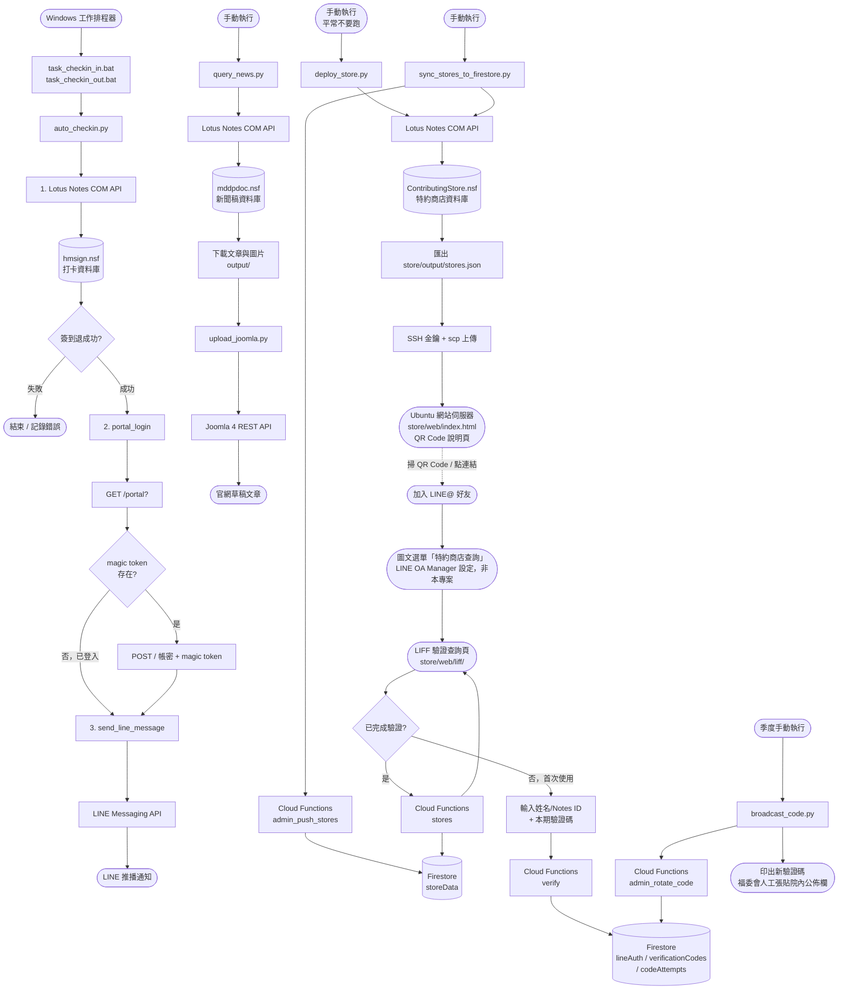

# autowork-lotusNotesCOM - Lotus Notes 自動化工具

透過 Lotus Notes COM API 操作院內 Notes 資料庫的自動化工具集，目前有四項功能：

- **功能一・打卡**：執行簽到/簽退，過程中順便完成院內 Portal 上網認證，並用 LINE 推播打卡結果通知。
- **功能二・新聞稿擷取**：從 Notes 資料庫擷取新聞稿內容與圖片，存到本機
- **功能三・上傳至 Joomla**：把擷取到的新聞稿透過 REST API 上傳到 Joomla 4 官網，存成草稿文章
- **功能四・特約商店查詢頁**：從 Notes 資料庫匯出特約商店優惠清單，部署成一個**限本院同仁使用**的查詢頁；同仁透過 LINE 官方帳號（LINE@）加好友、在 LIFF 頁完成身分綁定驗證後即可查詢，後端為 Firebase Cloud Functions + Firestore

各功能的詳細說明見下方對應章節。

---

## 系統流程圖



---

## 系統需求

| 項目 | 需求 |
|---|---|
| 作業系統 | Windows（僅限，依賴 COM API） |
| Python | 3.x **32-bit**（配合 Lotus Notes 8.5.3 32-bit） |
| Lotus Notes | 8.5.3，需在背景保持登入狀態 |
| 虛擬環境 | `venv32`（32-bit Python） |

---

## 安裝

```powershell
# 建立 32-bit 虛擬環境（使用 32-bit Python 執行檔）
& "C:\path\to\python32\python.exe" -m venv venv32

# 安裝套件
venv32\Scripts\pip.exe install pywin32 python-dotenv requests beautifulsoup4
```

---

## 環境設定（`.env`）

在專案根目錄建立 `.env`：

```
NOTES_PASSWORD=你的Notes密碼

JOOMLA_URL=https://你的網站網址/home
JOOMLA_TOKEN=你的JoomlaAPIToken
JOOMLA_CATEGORY_ID=8
JOOMLA_MEDIA_FOLDER=images/01news

PORTAL_URL=https://hltchnet.tzuchi.com.tw:1003/
PORTAL_USERNAME=你的員工編號
PORTAL_PASSWORD=你的密碼

LINE_CHANNEL_TOKEN=你的channel_access_token
LINE_USER_ID=你的line_user_id
```

> `.env` 已列入 `.gitignore`，不會被 git 追蹤。

---

## 功能一：打卡（`auto_checkin.py`）

執行流程：
1. **Lotus Notes 簽到／退** — 寫入 `hmsign.nsf`
2. **Portal 登入** — POST 至院內上網認證頁面，取得對外網路
3. **LINE 通知** — 推播完成訊息給自己

```powershell
# 簽到
venv32\Scripts\python.exe auto_checkin.py in

# 簽退
venv32\Scripts\python.exe auto_checkin.py out
```

**設定區（`auto_checkin.py` 頂部）：**

| 變數 | 說明 | 預設值 |
|---|---|---|
| `SERVER` | Domino 伺服器 | `hladmin2/medicine/Tzuchi` |
| `DB_PATH` | 打卡資料庫路徑 | `moghuman\hmsign.nsf` |
| `USER` | Notes 使用者名稱 | `曾建瑋/medicine/Tzuchi` |
| `SIGN_TYPE` | 班別代碼 | `N`（正常班） |

班別代碼：`N`=正常班　`A`=加班　`C`=OnCall　`S`=交接班

**日誌：** `checkin.log`

### 放假日跳過打卡

在專案根目錄的 `holidays.txt` 中，一行寫一個日期（格式 `YYYY-MM-DD`，`#` 之後視為註解），若執行當天的日期出現在清單中，`auto_checkin.py` 會**整個流程都跳過**（不打卡、不登入 Portal、不發 LINE 通知），僅在 `checkin.log` 留下一筆紀錄。

```
# holidays.txt 範例
2026-08-21          # 特休
2026-10-10          # 國慶日
```

`holidays.txt` 不存在或內容為空時，視為沒有放假日，照常執行打卡（不會報錯）。此檔案已列入 `.gitignore`，不會被 git 追蹤。

### LINE Messaging API 設定

1. 至 [LINE Developers](https://developers.line.biz/) 建立 Messaging API Channel
2. Basic settings → **Your user ID** → 填入 `.env` 的 `LINE_USER_ID`
3. Messaging API → **Channel access token** → 產生並填入 `.env` 的 `LINE_CHANNEL_TOKEN`

### Portal 登入說明

- 使用 `http.client` 直接發送 HTTPS 請求（繞過 urllib3 的 ALPN/HTTP2 協商，與院內 pfSense portal 相容）
- 流程：GET 取得 CSRF magic token → POST 送出帳密
- 若 Portal 已登入，自動跳過 POST

### Windows 工作排程器

| 批次檔 | 用途 |
|---|---|
| `task_checkin_in.bat` | 排程簽到（建議設定 08:00） |
| `task_checkin_out.bat` | 排程簽退（建議設定 17:00） |

設定方式：工作排程器 → 建立基本工作 → 觸發程序選「每天」→ 動作選「啟動程式」→ 選擇對應 `.bat` 檔。

---

## 功能二：新聞稿擷取（`query_news.py`）

連線至 `mddpdoc.nsf`，依日期區間下載新聞稿文字與內嵌圖片。

```powershell
venv32\Scripts\python.exe query_news.py
```

執行後輸入起訖日期：

```
起始日期 (YYYY/MM/DD): 2026/05/01
結束日期 (YYYY/MM/DD): 2026/05/31
```

**輸出結構：**

```
output/
├── checklist.json              ← 下載紀錄（防重複下載）
├── 20260506_新聞標題/
│   ├── content.txt             ← 文字內容
│   ├── img_000.jpg
│   └── img_001.jpg
└── 20260513_另一篇新聞/
    └── ...
```

**重複下載防護：**
- 已下載的文章會記錄在 `output/checklist.json`
- 再次執行同樣日期區間時，已下載的文章會自動跳過
- 若要強制重新下載，刪除 `checklist.json` 中對應的 UNID 記錄即可

---

## 功能三：上傳至 Joomla（`upload_joomla.py`）

將 `query_news.py` 下載的新聞稿上傳至 Joomla 4 網站，建立草稿文章。

```powershell
venv32\Scripts\python.exe upload_joomla.py
```

**前置條件（Joomla 後台）：**
1. Extensions → Plugins → 啟用 `API Authentication - Web Services Joomla Token`
2. Extensions → Plugins → 啟用 `Web Services - Content`
3. Extensions → Plugins → 啟用 `Web Services - Media`
4. Extensions → Plugins → 啟用 `System - Web Services`
5. Users → 你的帳號 → Joomla API Token → 產生 Token 並填入 `.env`

**圖片上傳路徑規則：**

```
images/01news/{年}/{月}/{月日}/{UNID前8碼}/img_000.jpg
```

範例：2026/05/13 的新聞稿（UNID 開頭 `BCE1730B`）：
```
images/01news/2026/05/0513/BCE1730B/img_000.jpg
```

**文章狀態：** 上傳後為**草稿（Unpublished）**，需至後台審核後手動發佈。

---

## 功能四：特約商店查詢頁（`store/`）

從 `ContributingStore.nsf` 匯出未作廢、未過期的特約商店清單，部署成一個給院內同仁用手機查詢的網頁。**查詢頁已上線存取控制**（見下方「特約商店查詢頁存取控制」）：`store/web/index.html` 現在是一個說明頁面，附上加入 LINE@ 好友的 QR Code 跟連結；同仁加好友後透過圖文選單進入 LIFF 查詢頁，實際查詢資料只能透過 LINE 登入 + 驗證碼綁定後取得。

> **`store/deploy_store.py` 平常不要再執行**：這支腳本會把 `stores.json`（完整店家資料）跟其他靜態頁面一起 scp 到正式站，一旦跑了就會讓 `stores.json` 重新變成任何人都能直接用網址抓取的公開檔案，等於繞過剛做好的存取控制。目前只保留這支腳本的原始碼與說明供參考／未來需要時查閱，日常更新特約商店清單一律改用下面的 `sync_stores_to_firestore.py`。若真的需要重跑 `deploy_store.py`（例如要更新 `join.html`/`qa.html`/`style.css` 這些靜態頁），跑完務必手動把正式站上的 `stores.json` 刪掉。

```powershell
venv32\Scripts\python.exe store\deploy_store.py
```

流程：匯出最新 `store/output/stores.json` → 透過 SSH 金鑰用 `scp` 把 `store/web/`（`index.html`、`join.html` 加入特約、`qa.html` 常見問題、`style.css` 共用樣式）與 `stores.json` 上傳到 Ubuntu 網站伺服器的 `STORE_REMOTE_PATH`。

**這支腳本目前必須手動執行**（不走排程）：因為這台機器的 Notes ID 沒有開放「允許其他 Notes 程式使用此密碼」，`Initialize()` 會跳出互動式密碼輸入視窗，需要在畫面上手動輸入密碼才能繼續，無法無人值守跑排程。之後如果想改成排程，要先在 Notes 用戶端的 **File → Security → User Security** 把該選項打開。

**`.env` 需要的欄位：**

```
SFTP_HOST=10.2.116.138
SFTP_PORT=22
SFTP_USER=你的SSH帳號
SFTP_KEY_PATH=C:\Users\peter\.ssh\tzuchi_store_deploy
STORE_REMOTE_PATH=/var/www/html/store
```

金鑰登入需要先把 `store/deploy_store.py` 用的公鑰（`%USERPROFILE%\.ssh\tzuchi_store_deploy.pub`）加到 Ubuntu 伺服器該帳號的 `~/.ssh/authorized_keys`。

**為什麼用 SSH 金鑰而不是 `paramiko`？** 這台機器是 Python 3.14（32-bit），`paramiko` 依賴的 `cryptography` 目前在 PyPI 上還沒有 cp314-win32 的預編譯 wheel，會退回原始碼建置並卡在院內網路的 SSL 憑證攔截。改用 Windows 內建的 OpenSSH 用戶端（`ssh.exe` / `scp.exe`）不用額外裝套件，也剛好符合排程需要非互動式登入（金鑰）的需求。

### 特約商店查詢頁存取控制（已上線）

完整設計見 `sdd3.md` §5。同仁掃 LINE@ QR code 加好友、點選圖文選單「特約商店查詢」，第一次使用會在 LIFF 頁輸入姓名/Notes ID + 院內公佈欄公告裡的本期驗證碼完成綁定，之後查詢優惠都透過這個 LINE@ 進行，不用重複驗證。後端是 Cloud Functions（Python）+ Firestore（專案 `hlwelfare`），本機這台機器完全不持有 Firebase 憑證，只用共用密鑰打 Cloud Functions 的 admin 端點——見 `firebase/` 目錄與下方新增的工具腳本。

已完成並實測：Cloud Functions 五支端點（`verify`／`stores`／`admin_push_stores`／`admin_rotate_code`／`admin_import_roster`）部署上線、`store/web/liff/index.html` 部署上線、真實 LINE 帳號走完「加好友 → 輸入姓名+驗證碼 → 查詢」全流程、`store/web/index.html` 正式切換成附加入 LINE@ 好友 QR Code 的說明頁（圖文選單「特約商店查詢」已在 LINE Official Account Manager 設定好連到 LIFF 頁，非本專案程式碼處理）、正式站殘留的公開 `stores.json` 已刪除。

**重新部署 Cloud Functions（改程式碼後才需要）：**

```powershell
cd firebase
firebase deploy --only functions
```

如果改到 `firestore.rules`/`firestore.indexes.json`，記得加上 `firestore:rules,firestore:indexes`。secrets（`ADMIN_SHARED_SECRET`、`LINE_LOGIN_CHANNEL_ID`）已經設定在 Cloud Functions 那端，改密鑰才需要重跑 `firebase functions:secrets:set`。

**`.env` 欄位（本機腳本用，不含任何 Firebase 憑證）：**

```
STORE_AUTH_FUNCTIONS_BASE_URL=https://us-central1-hlwelfare.cloudfunctions.net
ADMIN_SHARED_SECRET=（要跟 Cloud Functions 那端 ADMIN_SHARED_SECRET secret 的值一致）
LIFF_ID=2011285225-tzE9fFFl
STORE_LIFF_URL=https://liff.line.me/2011285225-tzE9fFFl
```

**例行操作：**

```powershell
# 把最新特約商店清單同步到 Firestore（給 LIFF 查詢頁用，取代 deploy_store.py 平常的角色）
venv32\Scripts\python.exe store\sync_stores_to_firestore.py

# 換一組新的期效性驗證碼並印出來（季度執行）。公告本身透過院內另一個 Notes 公佈欄
# 資料庫人工張貼，不是本專案程式碼處理的範圍。第一個參數是部門/情境名稱，純粹自己
# 追蹤用，不同名稱各自獨立換碼、互不影響。
venv32\Scripts\python.exe store\broadcast_code.py 職工福利小組

# 季度在職名單覆核：先 dry-run 看報告，確認沒問題再加 --commit 真的撤銷
venv32\Scripts\python.exe store\import_roster.py 名單.csv
venv32\Scripts\python.exe store\import_roster.py 名單.csv --commit

# 把 LIFF 驗證頁部署到 Ubuntu 主機（改了 store/web/liff/index.html 才需要重跑）
venv32\Scripts\python.exe store\deploy_liff.py
```

**尚未完成**（見 `sdd3.md` §9、§10）：連續打錯驗證碼會不會真的鎖定，還沒有拿真實 Firestore 環境測過（需要一個尚未驗證過的 LINE 身分才能測）；季度在職名單真實欄位格式尚未確認。

---

## 工具腳本

| 檔案 | 說明 |
|---|---|
| `check_notes.py` | 列出 hmsign.nsf 所有 View（維護用） |
| `inspect_news.py` | 列出 mddpdoc.nsf 的 View、Form 及第一筆欄位（維護用） |
| `query_checkin.py` | 查詢指定日期區間的打卡紀錄 |
| `store/inspect_store.py` | 列出 ContributingStore.nsf（特約商店）的 View、Form 及各 View 第一筆欄位（維護用） |
| `store/notes_store.py` | 共用模組：讀取未作廢、未過期的特約商店清單 |
| `store/query_store.py` | 互動式查詢特約商店，可依類別篩選、選擇性輸出 CSV |
| `store/export_store_json.py` | 匯出特約商店清單成 `store/output/stores.json`（給查詢頁用） |
| `store/deploy_store.py` | 匯出 JSON 並透過 SSH 金鑰部署查詢頁到 Ubuntu 網站伺服器 |
| `store/sync_stores_to_firestore.py` | 把特約商店清單同步到 Firestore，供存取控制上線後的 `/stores` API 使用 |
| `store/broadcast_code.py` | 換一組新的期效性驗證碼並印出來，供人工張貼到院內公佈欄；不同部門/情境各自獨立換碼 |
| `store/import_roster.py` | 匯入季度在職名單，覆核已驗證的 LINE 使用者是否還在職（預設 dry-run，`--commit` 才真的撤銷） |
| `store/deploy_liff.py` | 部署 LIFF 驗證查詢頁（`store/web/liff/index.html`）到 Ubuntu 網站伺服器 |

---

## 待辦事項

### Joomla 上傳功能（進行中）

- [ ] **安裝 `System - Web Services` 外掛**
  - 原因：Joomla 後台找不到此核心外掛，導致 API 路由無法啟用（回傳 401）
  - 解法：Extensions → Manage → Discover，或透過 FTP 上傳 `plugins/system/webservices/` 後重新 Discover 安裝
- [ ] 完整測試上傳流程（圖片 + 文章）
- [ ] 至 Joomla 後台確認草稿文章內容與圖片顯示正確
- [ ] 審核草稿後手動發佈，確認前台顯示正常

### 清理

- [ ] 刪除 `test_image_extract.py`（開發期間的診斷腳本，已無用途）
- [x] 刪除 `debug_portal.py`、`test_portal_line.py`（開發期間的診斷腳本，已無用途）

---

## 注意事項

- **Lotus Notes 必須安裝在系統上**，但不需要保持開啟或登入；`Initialize(password)` 會直接透過後端 COM API 建立 session
- win32com 存入 datetime 時會自動轉 UTC，程式內已用 `+timedelta(hours=8)` 補回台灣時區
- 打卡文件建立後**無法刪除或修改**（ACL 限制），請確認時間正確再執行
- `upload_joomla.py` 使用 `verify=False` 略過 SSL 驗證（因應醫院內網自簽憑證）
- Portal 登入改用 `http.client` 直接發送，避免 urllib3 的 ALPN 協商與院內 pfSense 不相容
