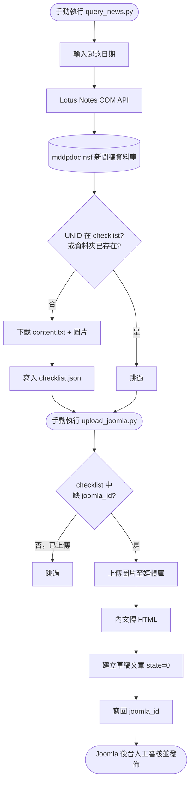

# SDD1 — 新聞稿自動上傳 Joomla

規格驅動開發文件。本文件回溯記錄「從 Lotus Notes 新聞稿資料庫擷取內容、自動上傳建立 Joomla 草稿文章」這項功能的現況規格，作為後續維護與技術債修正的基準，並標明此功能對 Joomla 正式站的影響面。

---

## 1. 背景與問題

院內新聞稿目前存放在 Lotus Notes 的 `mddpdoc.nsf`，對外官網（Joomla）需要人工手動搬運內容（複製文字、下載圖片、貼上、上傳圖片、排版）才能刊登，流程繁瑣且容易漏帶圖片或格式跑掉。本功能希望把「擷取 Notes 新聞稿」與「建立 Joomla 草稿文章」自動化，但**保留人工審核發佈**這一關，不讓程式直接把內容曝光到正式站。

## 2. 目標 / 非目標

**目標**
- 依日期區間從 `mddpdoc.nsf` 批次擷取新聞稿文字與內嵌圖片。
- 避免重複下載已抓過的文章。
- 把已下載但尚未上傳的文章，自動建立成 Joomla 草稿文章（含圖片），等待人工審核後發佈。
- 避免重複上傳同一篇文章。

**非目標（本階段不做）**
- 不自動發佈文章（`state` 固定為草稿 `0`，發佈永遠由人工在 Joomla 後台完成）。
- 不做排程自動執行（擷取需要互動輸入日期區間，且 Notes ID 目前沒開放非互動登入，`store/` 部署功能也有相同限制）。
- 不做 Joomla 端內容的更新／刪除同步（Notes 那邊如果事後改稿，不會回頭更新已上傳的 Joomla 草稿）。
- 不影響 Joomla 既有文章、分類、外掛設定——本功能只透過官方 REST API 新增內容，不碰資料庫、不改後台設定。

## 3. 使用者情境

> 我想幫某個月份的新聞稿建檔到官網。先執行 `query_news.py`，輸入起訖日期，程式會把這段期間所有新聞稿的文字和圖片抓下來存在本機資料夾，已經抓過的會自動跳過。接著執行 `upload_joomla.py`，程式會把還沒上傳過的文章逐篇建立成 Joomla 草稿（圖片也會一起上傳好放進內文），我最後只要進 Joomla 後台檢查排版、確認沒問題就按發佈。

## 4. 設計

### 4.1 新聞稿擷取（`query_news.py`）

| 項目 | 內容 |
|---|---|
| 資料來源 | Notes 伺服器 `mdaapa/medicine/Tzuchi`，資料庫 `OAuse\mddpdoc.nsf`，View「新聞稿」 |
| 篩選條件 | 文件 `fd_Date` 欄位落在使用者輸入的起訖日期區間內（含當天，結束日補到 23:59:59） |
| 輸出位置 | `OUTPUT_DIR`（目前寫死 `c:\Users\peter\Desktop\autoRPA2-lotusNotesAPI\output`，見「7. 已知問題」） |
| 輸出結構 | 每篇一個資料夾 `YYYYMMDD_標題前50字`，內含 `content.txt`（標題+分隔線+內文）與 `img_000.jpg`…（依 DXL 匯出解出的內嵌圖片，支援 jpeg/gif/png） |
| 去重機制 | 雙重比對：① UNID 是否已存在 `checklist.json` ② 對應資料夾是否已存在 `content.txt`，符合任一項即跳過（第②項會補登 checklist，避免資料夾在但清單漏記） |
| Checklist 欄位 | `date`／`subject`／`folder`／`chars`／`images`／`downloaded_at`（此階段還沒有 `joomla_id`） |

### 4.2 上傳 Joomla（`upload_joomla.py`）

| 項目 | 內容 |
|---|---|
| 待上傳判定 | `checklist.json` 中**沒有 `joomla_id` 欄位**的項目 |
| 連線前置檢查 | 執行一開始先 GET 一篇文章測試 `JOOMLA_URL` / `JOOMLA_TOKEN` 是否有效，失敗直接中止（不會半途污染資料） |
| 圖片上傳 | Base64 編碼後 POST `/api/index.php/v1/media/files`，路徑規則 `{JOOMLA_MEDIA_FOLDER}/{年}/{月}/{月日}/{UNID前8碼}/img_NNN.ext` |
| 內文轉換 | 讀 `content.txt`，跳過前 3 行（標題/分隔線/空行），依空行分段包成 `
`，圖片網址附加於文末 |
| 建立文章 | POST `/api/index.php/v1/content/articles`，固定 `state=0`（草稿）、`catid` 取自 `.env` 的 `JOOMLA_CATEGORY_ID`、`publish_up` 設為新聞稿日期當天 08:00 |
| 完成標記 | 成功後把 `joomla_id`、`joomla_uploaded_at` 寫回 `checklist.json`，避免下次重複上傳 |
| 失敗處理 | 單篇建立文章失敗會印出錯誤並計入失敗數，不寫入 `joomla_id`，下次執行會重試；**但單張圖片上傳失敗不會阻止文章建立**（見已知問題） |

### 4.3 流程圖

## 5. 對 Joomla 正式站的影響面

這是專案中**唯一會直接寫入 Joomla 正式站資料庫**的功能（特約商店查詢頁只用 SCP 放靜態檔案，不經過 Joomla API）。影響範圍：
- 會新增 `articles`（草稿狀態）與 `media/files`（圖片）內容，不會修改或刪除任何既有內容。
- 依賴 Joomla 後台需啟用 `System - Web Services`、`Web Services - Content`、`Web Services - Media`、`API Authentication` 四個外掛（見「8. 驗收標準」，目前卡在第一項未裝）。
- 任何對這支腳本的修改，都必須先在測試分類（`JOOMLA_CATEGORY_ID`）驗證過，不得直接對正式分類跑未測試過的版本。

## 6. 邊界情境

| 情境 | 現況行為 |
|---|---|
| `checklist.json` 不存在或為空 | 提示「請先執行 query_news.py」後結束，不報錯 |
| 沒有待上傳文章 | 印出「沒有待上傳的文章」後結束 |
| 找不到對應資料夾 | 印出錯誤、計入失敗數，略過該篇 |
| 部分圖片上傳失敗 | **不會**中止該篇，文章仍會用已成功的圖片建立並標記為已上傳（技術債，見 7.1） |
| 內文含 `<`、`>`、`&` 等 HTML 特殊字元 | **未跳脫**，可能破壞版面或被瀏覽器誤判為標籤（技術債，見 7.2） |
| Joomla API Token 失效 / 外掛未啟用 | 開頭連線測試會抓到並印出提示，直接 `exit(1)`，不會消耗任何一篇文章的上傳次數 |
| 同一篇文章重複執行上傳 | 已有 `joomla_id` 者會被排除，不會建立第二篇 |

## 7. 已知問題 / 技術債

| # | 問題 | 影響 | 建議 |
|---|---|---|---|
| 7.1 | 單張圖片上傳失敗不會擋下文章建立，且整篇一旦有 `joomla_id` 就從待辦清單移除，失敗的圖片永久遺失、無法重跑 | 高（資料完整性，且不會被發現） | checklist 改記錄每張圖片的上傳結果，讓失敗的圖片可單獨重試 |
| 7.2 | `text_to_html()` 未對內文做 HTML escape | 中（版面錯亂／潛在標籤污染） | 轉換前加 `html.escape()` |
| 7.3 | 上傳狀態只存在本機 `checklist.json`，不會回頭核對 Joomla 現有文章 | 中（檔案遺失或誤刪會導致重複建立草稿） | 上傳前可加一道用標題+日期查詢 Joomla API 的防重複檢查 |
| 7.4 | 只印在終端機，沒有落地 log 檔 | 中（無法排程、事後無法追查失敗原因） | 比照 `auto_checkin.py` 加 `checkin.log` 模式的 log 檔 |
| 7.5 | `OUTPUT_DIR` 寫死成舊專案路徑 `autoRPA2-lotusNotesAPI\output`，與現在的專案資料夾（`autowork-lotusNotesCOM`）不一致 | 低（目前兩支腳本用同一條寫死路徑還接得起來，但一旦路徑失效兩邊會同時壞掉） | 改成 `os.path.join(os.path.dirname(__file__), "output")` |

## 8. 驗收標準

- [x] 依日期區間可從 `mddpdoc.nsf` 正確擷取文字與圖片，已下載的文章重跑會自動跳過
- [ ] Joomla 後台已安裝並啟用 `System - Web Services` 外掛（目前缺，API 回 401，見 README 待辦事項）
- [ ] 完整跑過一次「擷取 → 上傳」流程，含圖片，確認草稿文章內容與圖片顯示正確
- [ ] 審核草稿後手動發佈，確認前台顯示正常
- [ ] 確認重複執行 `upload_joomla.py` 不會建立重複文章

> 目前狀態：**擷取階段（4.1）已驗證可用；上傳階段（4.2）程式已寫完，但因 Joomla 外掛未安裝，尚未完整跑過驗收流程**，上方「7. 已知問題」列出的技術債也建議在正式排上正式站前一併處理。

## 9. 待確認 / 後續可討論事項

- 是否要在真正排程自動化前，先手動穩定跑過幾輪，確認 Joomla API 沒有院內網路（自簽憑證、pfSense）造成的間歇性問題（`auto_checkin.py` 的 Portal 登入功能就曾遇過 SSL/ALPN 相容性問題，需要留意這裡是否也會遇到）。
- 7.1～7.4 的技術債要不要在下一輪開發直接處理，還是先維持現況、等真正要排程化時再補。
- 若未來評估 Joomla REST API 長期不穩定，可參考特約商店查詢頁「Notes → JSON → 靜態頁」的模式作為備案（但會犧牲現有的人工審核流程，需另外設計審核機制）。
