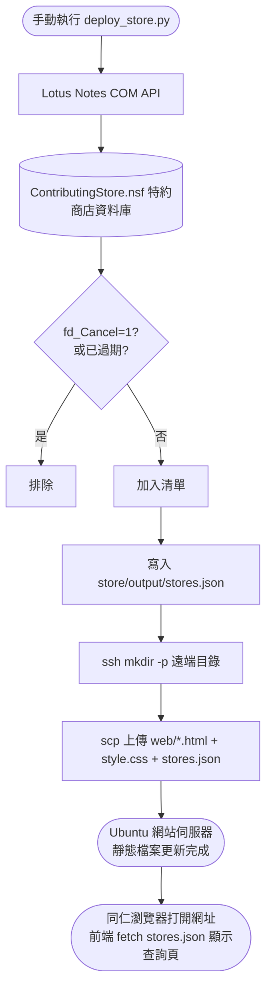
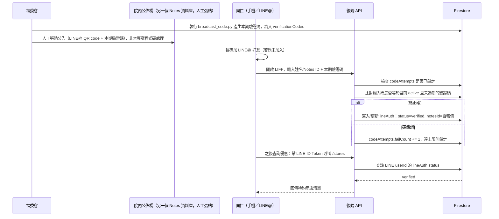

# SDD3 — 特約商店查詢頁自動部署與存取控制

規格驅動開發文件。本文件回溯記錄「從 Lotus Notes 特約商店資料庫匯出清單、部署成靜態查詢網頁」這項功能的現況規格，並記錄後續「加上身分驗證，僅限院內同仁查詢」的設計決策，作為接下來開發的依據。

---

## 1. 背景與問題

院內同仁常需要查詢目前有哪些特約商店優惠，原本清單只存在 Lotus Notes 的 `ContributingStore.nsf`，同仁若沒有 Notes 用戶端或不方便用手機查 Notes，取得資訊不方便。本功能把資料庫內容匯出成一個手機可查的靜態網頁。

**存取控制的緣由**：查詢頁上線初期刻意不做登入驗證，原因是資料本身（店名、地址、優惠內容）敏感度低。但後續盤點實際特約合約（見 §5.4）發現，招募店家時醫院是以「員工專屬優惠」「接觸院內同仁客群」作為條件，部分合約亦明文「本優惠僅提供予甲方所屬員工，不得轉借他人使用」。查詢頁完全公開，等於讓「取得優惠資訊」這一步失去員工限定的意義，因此決定補上身分驗證，僅限院內同仁能查詢。

## 2. 目標 / 非目標

**目標**
- 從 `ContributingStore.nsf` 匯出「未作廢、未過期」的特約商店清單。
- 部署成手機瀏覽器可查詢（關鍵字搜尋 + 類別篩選）的靜態網頁。
- 網頁放在既有 Joomla 網站伺服器上，但**不經過 Joomla 的資料庫或文章系統**，只用檔案系統層級的靜態檔案部署。
- 查詢頁需完成身分驗證才能查詢，且驗證流程在院外（同仁自己的手機、行動網路）也要能完成綁定後的日常查詢（見 §5）。
- 驗證機制僅此一條路徑可進入，不應存在其他能取得查詢權限的旁路（見 §5.5）。

**非目標**
- 不做網頁端的新增/編輯功能（`join.html` 是純靜態說明頁，不是表單送出到後端）。
- 不透過 Joomla 內容管理介面呈現，因此不使用、也不影響 Joomla 既有的文章、分類、外掛設定。
- 不排程自動化資料匯出/部署（見「7. 邊界情境」，Notes ID 密碼互動限制與新聞稿擷取功能相同）。
- **身分驗證不蒐集、不保存身分證字號或其他高敏感個資**（原因見 §5.4）。
- 不做個別同仁的身分查證比對（原方案需要查 Domino 通訊錄，實測不可行，見 §5.4、§5.6）；同仁申請時自報的姓名／Notes ID 僅供 §5.7 名單覆核使用，不是安全驗證依據。

## 3. 使用者情境

**匯出/部署（維護者視角）**
> 我想讓同仁不用開 Notes，直接用手機查特約商店。執行 `deploy_store.py`，程式會去 Notes 撈最新清單、轉成 JSON、透過 SSH 金鑰把查詢頁的檔案跟 JSON 一起丟到網站伺服器的指定目錄。

**查詢（同仁視角，加上身分驗證後）**
> 我從院內公佈欄公告（附 QR code）加入 LINE@「花蓮職工福利行政小組」好友，開啟查詢頁後輸入我的姓名和公告裡的本期驗證碼。輸入正確就完成驗證，之後不管人在哪裡、用行動網路，只要透過這個 LINE@ 就能直接查特約商店優惠，不用再驗證第二次，除非驗證碼換期又被踢出名單。

## 4. 設計：資料匯出與部署（現況，已實作）

### 4.1 資料撈取與篩選（`notes_store.py` → `fetch_active_stores()`）

| 項目 | 內容 |
|---|---|
| 資料來源 | Notes 伺服器 `mdaapa/medicine/Tzuchi`，資料庫 `OAUse\ContributingStore.nsf`，View「依商店」 |
| 排除條件 | `fd_Cancel == "1"`（已作廢）直接排除 |
| 過期判斷 | `fd_ChangeDate` 視為到期日，+8 小時校正 UTC 後取日期，早於今天者排除；欄位不存在則視為無到期日（永久有效） |
| 欄位 | `name`／`kind`／`tel`／`address`／`contents`／`expire`（ISO 日期字串或 `null`） |
| 排序 | 依 `(kind, name)` |

### 4.2 匯出 JSON（兩個入口，邏輯各自獨立）

- `export_store_json.py`：獨立手動匯出，寫到 `store/output/stores.json`，不部署（供本機檢查用）。
- `deploy_store.py`：內部直接呼叫 `fetch_active_stores()`（不呼叫前者，邏輯重複但獨立維護），匯出後緊接部署流程。

### 4.3 部署（`deploy_store.py`）

| 步驟 | 內容 |
|---|---|
| ① 產生 JSON | 寫入 `store/output/stores.json`，含 `generated_at` 時間戳 |
| ② 確保遠端目錄 | `ssh mkdir -p {STORE_REMOTE_PATH}` |
| ③ 上傳檔案 | `scp` 依序上傳 `index.html`／`join.html`／`qa.html`／`style.css`／`stores.json`，單檔失敗重試一次，仍失敗則整體中止 |
| 連線方式 | SSH 金鑰登入（非密碼），金鑰路徑來自 `.env` 的 `SFTP_KEY_PATH`；`BatchMode=yes` 避免金鑰失敗時卡住等密碼輸入 |
| 32-bit 特例 | 因專案是 32-bit Python，會被 WOW64 導向 `SysWOW64`（無 OpenSSH），改用 `C:\Windows\Sysnative\OpenSSH` 繞過導向找到真正的 64-bit `ssh.exe`/`scp.exe` |
| 終端機注意事項 | scp 進度條用 `\r` 覆寫輸出，在 VS Code 整合終端機的 pty 裡會卡住（一般 Windows 終端機不受影響）；因此一律用 `capture_output=True` 擷取輸出，不讓進度條直接寫進終端機 |

### 4.4 查詢頁前端（`store/web/`，現況）

| 檔案 | 用途 |
|---|---|
| `index.html` | 主查詢頁：頁面載入時 `fetch("./stores.json")`，前端關鍵字搜尋（比對名稱/地址/內容）+ 類別下拉篩選；類別會依調色盤自動配色、依關鍵字配對圖示 |
| `join.html` | 加入特約店家的說明頁（靜態內容） |
| `qa.html` | 常見問題（靜態內容） |
| `style.css` | 共用樣式（花蓮慈濟醫院官網視覺風格：主色 `#0345bf`、青色點綴 `#1d8989`） |

> **§5 已上線，本節內容現況已變動（2026-08-27）**：`store/web/index.html` 已從原本直接 `fetch("./stores.json")` 的查詢頁，改成一個純說明頁面（附加入 LINE@ 好友的 QR Code 與連結；同仁加好友後透過圖文選單「特約商店查詢」進入 LIFF 驗證查詢頁，不是直接連到 LIFF——這樣才能確保同仁真的成為好友，未來其他功能上到圖文選單上才看得到，見 2026-08-27 的調整）；正式站上原本公開的 `stores.json` 已手動刪除，`store/deploy_store.py` 這支腳本平常不再執行（會重新把 `stores.json` 公開），改由 `store/sync_stores_to_firestore.py` 負責把資料同步到 Firestore，供帶身分憑證的 `/stores` API 使用（詳見 §5.3、§5.5，以及本文件實作計畫的「架構總覽」）。`deploy_store.py` 的程式碼保留，供未來需要更新 `join.html`/`qa.html`/`style.css` 時使用。

### 4.5 匯出/部署流程圖

## 5. 設計：存取控制（LINE@ + 期效性驗證碼，已上線，2026-08-27）

> 本節取代了較早期「個人化 Notes 信箱驗證連結」的設計（原始版本見 git 歷史）。實測福委會共用的 Notes 帳號**只能寄信，無法存取/查詢 Domino 通訊錄**，原設計依賴的「輸入 Notes ID → 查通訊錄取得信箱 → 寄個人化驗證連結」技術上不可行，已放棄，改為本節的「廣播式期效性驗證碼」設計。

### 5.1 架構總覽

三個角色：

| 角色 | 功能 |
|---|---|
| LINE 官方帳號「花蓮職工福利行政小組」（LINE@ / LIFF） | 同仁查詢的入口與身分憑證來源（`liff.getProfile()` 取得穩定的 LINE `userId`） |
| Firebase（Firestore） | 保存「目前有效的驗證碼」與「LINE userId ↔ 驗證狀態」對應表，是唯一的權限判斷依據 |
| 院內公佈欄（另一個 Notes 資料庫，福委會既有的公告管道，非本專案程式碼處理） | 定期公告本期驗證碼與 LINE@ 加入方式，只有能看到院內公告的人（即同仁）才拿得到本期的碼；本專案只負責換碼，公告本身由福委會人工張貼 |

### 5.2 資料模型（Firebase Firestore）

**Collection：`verificationCodes`**

| 欄位 | 型別 | 說明 |
|---|---|---|
| Document ID | string | 驗證碼本身（建議至少 6 碼英數混合，避免被猜中） |
| `validFrom` | timestamp | 生效時間 |
| `validUntil` | timestamp | 失效時間（例如每季輪替一次） |
| `active` | boolean | 目前是否為現行有效碼；換期時把「同一個 `label`」的舊碼設為 `false`，新增新碼 |
| `label` | string | 部門/情境名稱，操作者自己追蹤用（例如「職工福利小組」），不影響查詢得到的資料。不同 `label` 的碼各自獨立換期、可同時有效（2026-08-27 新增，取代原本「同時間只有一組有效碼」的設計） |

**Collection：`lineAuth`**，Document ID：LINE `userId`

| 欄位 | 型別 | 說明 |
|---|---|---|
| `notesId` | string | 同仁驗證時**自報**的姓名／Notes ID（例如「花蓮陳麗玉」），不驗證真偽，僅供 §5.7 名單覆核比對用 |
| `status` | string | `"verified"` \| `"revoked"` |
| `verifiedAt` | timestamp | 驗證成功時間 |
| `revokedAt` | timestamp \| null | 被 §5.7 季度覆核撤銷的時間 |
| `verifiedViaLabel` | string | 驗證當下用的是哪個 `label` 的碼，純記錄用途（2026-08-27 新增） |

**Collection：`codeAttempts`**（防暴力猜測用），Document ID：LINE `userId`

| 欄位 | 型別 | 說明 |
|---|---|---|
| `failCount` | number | 連續輸入錯誤次數 |
| `lockedUntil` | timestamp \| null | 鎖定解除時間，超過失敗次數上限後鎖定一段時間 |

**刻意不存的欄位**：身分證字號、電話等其他個資。`notesId` 是自報值，不是查證過的身分。

**Collection：`storeData`**，Document ID 固定為 `current`

| 欄位 | 型別 | 說明 |
|---|---|---|
| `generated_at` | string | 資料產生時間，跟 `stores.json` 的同名欄位同格式 |
| `stores` | array | 商店清單，欄位結構與現行 `stores.json` 的 `stores` 陣列相同（`name`/`kind`/`tel`/`address`/`contents`/`expire`） |

由 `store/sync_stores_to_firestore.py`（複用 `notes_store.fetch_active_stores()`）寫入，`/stores` 端點驗證身分通過後直接回傳這份文件。跟 §4 現有 `stores.json` 的公開靜態檔完全獨立，兩邊各自部署、互不影響（實作時的決策，見 `firebase/functions/main.py`）。

### 5.3 驗證與查詢流程

驗證變成**單次同步比對**，不再有「申請 → 等信 → 點連結」的非同步狀態機（原設計的 `token`／`pending` 已移除）：

**關鍵設計點**：驗證碼是唯一的把關依據，不做個別身分查證；一旦驗證成功即long-lived（不因驗證碼換期而自動失效），要撤銷已驗證帳號一律透過 §5.7 的季度名單覆核，不是靠「舊碼過期」本身踢人。

### 5.4 已考慮並排除的替代方案

| 方案 | 排除原因 |
|---|---|
| 純輸入姓名 + 身分證後 5 碼比對，存進 Firebase 當驗證基準 | 需要新蒐集、保存員工身分證字號，屬個資法「特定目的外利用」，需額外取得同意或更新個資告知事項，法遵成本高 |
| 用員工編號取代身分證 | 多數同仁記不住自己的工號，驗證體驗差 |
| 掛在院內上網認證 Portal（`auto_checkin.py` 用的那個）後面 | 該 Portal 是院內網路的 captive portal，離開院內網路（同仁在店家現場用手機查）根本連認證頁面都打不到，違背「院外可查」的核心需求 |
| 個人化 Notes 信箱驗證連結（輸入完整 Notes ID → 查通訊錄取得信箱 → 寄個人化連結） | **實測發現福委會共用 Notes 帳號只能寄信，無法存取/查詢 Domino 通訊錄**，技術上做不到，已放棄，改用本節的廣播式驗證碼 |
| 資料改存自己桌機的資料庫，或改存到既有 Ubuntu 網站伺服器的 MySQL（不用 Firebase） | 技術上可行但複雜許多，考慮後放棄： 1) 桌機在院內網路，沒有公開 IP、IT 不會開放 inbound，LINE 手機端申請這種**外部發起**的請求無法直接寫進桌機資料庫，只能設計成「桌機定期 outbound 443 去輪詢公開伺服器」的拉取模式，多一層間接。 2) 改存 Ubuntu 主機的 MySQL 雖然不需要新開防火牆 port，但要自己寫、部署、長期維運一套後端服務，維運成本遠高於 Firebase 的全代管服務。 3) 換來的好處只有「不多一個第三方存資料」，但這裡要存的資料本身敏感度不高，不足以證明額外的長期維運成本合理 → 維持用 Firebase |

### 5.5 安全性要求

- **驗證碼強度**：至少 6 碼英數混合，避免容易猜測的組合（連號、生日等）。
- **驗證碼時效**：每期（例如每季）輪替一次，到期即失效，逾期輸入視為錯誤。
- **防暴力猜測**：同一 LINE `userId`（或來源 IP）連續輸入錯誤達上限次數後鎖定一段時間，見 §5.2 `codeAttempts`。
- **Firestore 安全規則必須完全禁止前端直接寫入 `lineAuth.status`**：只能由後端（Cloud Function，使用 Admin SDK）在驗證碼比對通過後寫入，避免有人繞過驗證碼直接偽造已驗證狀態。
- **後端不得存在第二條能把某筆紀錄標記為 `verified` 的路徑**（不留測試後門或管理員快速核准之類的旁路），確保「輸入正確驗證碼」是唯一能取得查詢權限的方式（呼應 §2 目標）。
- **查詢資料的實際存取權限判斷必須在後端**：不可只靠「LIFF 頁面只能在 LINE App 內開啟」這種前端限制當作安全邊界，一律以後端查 Firestore 的 `status` 欄位為準。
- `stores.json` 不可再是可直接用網址抓取的靜態檔案（見 §4.4 附註），需改為需要身分憑證才能呼叫的 API。
- 公告內容應提醒同仁「驗證碼請勿轉發給非本院同仁」，降低碼外流的風險（碼外流是殘餘風險，非目標是做到完全杜絕，見 §5.4 討論脈絡：真正的優惠兌現關卡仍在店家現場核對員工證）。

### 5.6 已知相依限制

- **公告管道是福委會既有的院內公佈欄（另一個 Notes 資料庫），由福委會人工張貼，不是本專案程式碼處理的範圍**。本專案只透過 `broadcast_code.py` 換一組新碼並印出來，換碼完成後的公告動作（貼公佈欄）完全是人工操作。此前規劃過「用 Notes COM API 程式化寄送群組信」的做法已放棄——不是技術做不到，是福委會原本就有更合適的公告管道，不需要本專案重新發明。
- `broadcast_code.py`（換碼）本身完全不需要連 Notes，只打 Cloud Functions 的 `admin_rotate_code`，不受 §7、§8.3 提到的 Notes 密碼互動限制影響；但換碼後貼公佈欄仍是人工動作，整體流程不是即時全自動。

### 5.7 定期名單覆核與撤銷（離職同仁）

福委會每季會取得一份最新在職同仁名單，**不在名單中的人視為無查詢資格**（含離職）。用這份名單做定期覆核，取代另外追蹤「離職事件」：

| 項目 | 內容 |
|---|---|
| 資料來源 | 福委會每季提供的在職名單（人工匯入，格式待確認，見 §10） |
| Firestore 新增 collection | `activeRoster`，Document ID 用 Notes ID（與 `lineAuth.notesId` 用同一組識別，才能比對），內容至少含姓名、匯入時間 |
| 匯入方式 | 每季手動執行一支匯入腳本（沿用 `deploy_store.py` 的風格：讀名單檔 → 清空重寫 `activeRoster`），不做即時同步 |
| 覆核邏輯 | 匯入名單後，遍歷 `lineAuth` 中 `status == "verified"` 的紀錄，若其 `notesId` 不存在於最新 `activeRoster`，將該筆 `status` 改為 `"revoked"`，並記錄 `revokedAt` |
| 撤銷後行為 | `status == "revoked"` 的 LINE userId 呼叫查詢 API 一律拒絕，等同未驗證；若本人仍在職但名單漏列或自報姓名/Notes ID 打錯字導致誤判，需重新走一次 §5.3 的驗證流程 |
| 執行頻率 | 跟名單到手頻率一致（每季一次），不需要更即時，符合「離職後最慢一季內失去查詢權限」的容忍度（若需更即時，屬另一個待確認的取捨，見 §10） |

**待確認**：
1. 這份季度名單目前的識別欄位是什麼（Notes ID／工號／純姓名）？若不是 Notes ID，需要先有一步轉換或由福委會提供對照。
2. `lineAuth.notesId` 是同仁**自報**的值（沒有經過通訊錄驗證真偽），若同仁打錯字或格式跟名單不一致（例如漏打地區前綴「花蓮」），會被誤判為離職而撤銷——需要設計比對時的容錯（例如只比對姓名去掉地區前綴後的部分），或在撤銷前先做人工覆核一次再正式生效。

**實作現況（暫定，等上述待確認事項有答案再調整）**：`firebase/functions/roster_match.py` 先用「去除常見縣市地區前綴後比對姓名」當容錯規則，且 `admin_import_roster` 端點預設 `commit=false`（只回傳 dry-run 差異報告，不會真的撤銷），要操作者確認報告合理後再帶 `commit=true` 執行一次才會真的寫入 `revoked`——等於已經內建了「人工覆核」這一步，不會因為比對邏輯還不成熟就直接誤判撤銷在職同仁。另外加了一道防呆：新名單筆數若少於目前已驗證人數的一半，預設直接擋下（防止誤傳截斷檔案），需要帶 `force=true` 才會略過。

## 6. 對 Joomla 正式站的影響面

與新聞稿上傳功能不同，本功能**完全不經過 Joomla 的 REST API 或資料庫**：
- 資料匯出/部署（§4）是把靜態檔案透過 SSH/SCP 放進網站伺服器檔案系統下的 `STORE_REMOTE_PATH` 子目錄，不影響 Joomla 現有文章、分類、選單、外掛或後台設定。
- 存取控制（§5）的後端／Firebase 是全新獨立的基礎設施，同樣不經過 Joomla，唯一交集是查詢頁最終仍部署在 Joomla 網站伺服器底下的同一個子目錄。
- 部署失敗（SSH/SCP 錯誤）最多只影響 `STORE_REMOTE_PATH` 這個子目錄本身，不會波及 Joomla 其他部分；風險僅限於部署路徑設定錯誤時可能覆蓋到不該覆蓋的目錄（見「8. 已知問題」8.1）。

## 7. 邊界情境

| 情境 | 現況行為 |
|---|---|
| `.env` 缺 `SFTP_HOST`/`SFTP_USER`/`SFTP_KEY_PATH`/`STORE_REMOTE_PATH` 任一項 | 啟動時直接 `raise SystemExit`，不會嘗試連線 |
| 遠端目錄不存在 | 自動 `mkdir -p` 建立 |
| SCP 單檔上傳失敗（網路抖動） | 自動重試一次；第二次仍失敗則整支腳本中止，已上傳的檔案不會回滾 |
| Notes ID 未開放「允許其他 Notes 程式使用此密碼」 | `Initialize()` 會跳出互動式密碼視窗，**無法無人值守排程**，必須手動在畫面上輸入密碼；影響 `fetch_active_stores()` 這類需要連 Notes 的操作，不影響 §5 換碼本身（`broadcast_code.py` 不連 Notes，見 §5.6） |
| 商店資料 `fd_ChangeDate` 欄位不存在 | 視為無到期日，永久顯示在清單中 |
| `STORE_REMOTE_PATH` 設定錯誤（指到非預期目錄） | 腳本不會檢查目的地是否合理，會直接把檔案 scp 上去——**設定錯誤時有覆蓋錯誤目錄的風險**（見已知問題 8.1） |
| （§5 規劃）驗證碼輸入錯誤達失敗次數上限 | 待設計：鎖定該 LINE userId 一段時間，並提示鎖定原因與解除時間 |
| （§5 規劃）驗證碼已過期才輸入 | 待設計：提示「本期驗證碼已失效，請洽福委會取得最新驗證碼」，不應判定驗證成功 |
| （§5 規劃）驗證碼換期後，先前已驗證成功的 LINE userId | 設計為維持 `verified`，不因換期自動失效，撤銷只透過 §5.7 季度覆核 |
| （§5 規劃）同仁離職 | 已設計（見 §5.7）：每季用最新在職名單覆核 `lineAuth`，不在名單中者 `status` 改為 `revoked`；名單識別欄位格式、自報姓名與名單比對容錯待確認（見 §10） |
| （§5.7 規劃）名單匯入時格式有誤或缺漏 Notes ID | 待設計：應先驗證匯入的名單筆數/欄位完整性再覆核，避免誤判在職同仁為離職 |

## 8. 已知問題 / 技術債

| # | 問題 | 影響 | 建議 |
|---|---|---|---|
| 8.1 | `STORE_REMOTE_PATH` 純靠 `.env` 手動設定，程式不做任何合理性檢查（例如是否為空字串、是否為根目錄） | 中（設定錯誤時可能覆蓋錯誤位置的檔案） | 部署前加一道基本檢查（例如禁止空字串或 `/`），或至少在輸出中明確印出即將部署的完整目的地路徑供人工確認 |
| 8.2 | `export_store_json.py` 與 `deploy_store.py` 各自獨立呼叫 `fetch_active_stores()`、各自組出幾乎相同的 JSON 輸出邏輯 | 低（重複程式碼，非功能性風險） | 可考慮讓 `deploy_store.py` 直接沿用 `export_store_json.py` 的匯出邏輯，而不是重寫一份 |
| 8.3 | 目前無法排程，只能手動執行並手動輸入 Notes 密碼；影響 `fetch_active_stores()` 相關的資料更新即時性（§5 的 `broadcast_code.py` 換碼本身不連 Notes，不受此限制，但換碼後貼公佈欄仍是人工動作） | 中（資料新鮮度依賴人工記得執行） | 待 Notes ID 開放「允許其他程式使用此密碼」後，可比照自動打卡功能的排程模式（Windows 工作排程器）自動化 |
| 8.4 | （§5 規劃）離職同仁權限撤銷靠每季人工匯入名單覆核（§5.7），不是即時撤銷 | 低（**容忍度已確認為極大**：查詢頁只是提供優惠資訊，實際兌現優惠仍需在店家現場出示員工識別證核實身分，見 §5.4 合約盤點結論，因此查詢權限本身晚一季撤銷不構成實質風險） | 維持季度覆核即可，不需要更即時的名單來源 |
| 8.5 | （§5 規劃）`lineAuth.notesId` 是自報值，未經過通訊錄或名單即時驗證真偽 | 低～中（可能打錯字，或極少數情況故意填錯造成 §5.7 覆核誤判） | 覆核時比對邏輯需要容錯（見 §5.7 待確認 2），必要時季度覆核前先人工抽查 |
| 8.6 | （§5 規劃）驗證碼防暴力猜測機制（`codeAttempts` 鎖定）尚未實作、未經測試 | 中（若沒做好，驗證碼會是整個存取控制的單點弱點） | 落地時優先做好，並實際測試鎖定行為是否如預期 |

## 9. 驗收標準

**資料匯出與部署（已實作）**
- [x] 可正確篩選出未作廢、未過期的商店清單
- [x] `stores.json` 可正確產出並含 `generated_at` 時間戳
- [x] SSH 金鑰登入可成功、遠端目錄不存在時可自動建立
- [x] 查詢頁可用關鍵字與類別篩選正確顯示資料
- [x] 已實際部署上線
- [ ] SCP 部署失敗時的重試與中止行為尚未有意外情境下的實測記錄（僅程式邏輯層面確認）

**存取控制（已部署上線，2026-08-27 用真實 LINE 帳號實測過核心流程）**
- [x] `broadcast_code.py` 可換一組新驗證碼並印出，供福委會人工張貼到院內公佈欄（不透過本專案程式碼寄信，見 §5.6 修正）
- [x] 同仁可在 LIFF 輸入姓名/Notes ID + 驗證碼完成驗證，Firestore 正確寫入 `lineAuth` 為 verified（真實 LINE 帳號實測成功）
- [ ] 驗證碼錯誤時不會誤判成功，且連續錯誤達上限會被鎖定（`codeAttempts`）——「不會誤判成功」已間接驗證（單元測試 + 正式環境用錯誤碼測試皆正確拒絕），但「連續錯誤達上限鎖定」這段 transaction 邏輯還沒拿真實 Firestore 測過，需要一個尚未驗證過的 LINE 身分才能測，見 §10
- [ ] 驗證碼過期後輸入會被拒絕並提示重新取得最新碼（邏輯已寫，尚未實測）
- [x] 不同部門/情境可各自持有一組獨立驗證碼，同時有效、互不影響（2026-08-27 正式環境實測：換部門 A 的碼不影響部門 B 已生效的碼）
- [x] 未驗證的呼叫者打 `/stores` 會被拒絕（實測：沒帶 token 回 401；帶假 token 後端會真的去打 LINE API 驗證後拒絕）——「已撤銷」的情境（§5.7 revoke 後）尚未實測，因為還沒有真實名單可以觸發撤銷
- [x] `stores.json` 不再是可被直接以網址取得的公開靜態檔案（正式站已刪除，實測回 404；`store/web/index.html` 已切換成附加入 LINE@ 好友 QR Code 的說明頁，透過圖文選單進入 LIFF 查詢頁）
- [x] Firestore 安全規則已鎖死前端直接寫入 `lineAuth.status` 的能力，僅後端可寫入（`firestore.rules` 已部署，內容為全部拒絕）
- [ ] 每季名單匯入後，不在名單中的已驗證 LINE userId 會被改為 `revoked`，且 `revoked` 帳號無法再查詢（邏輯已寫，需要真實名單才能實測）
- [x] 名單匯入時能檢查基本格式（筆數、必要欄位），避免匯入異常名單造成大量誤撤銷（正式環境實測：空名單會被 `admin_import_roster` 擋下，回傳 `blocked: true`）

## 10. 待確認 / 後續可討論事項

- ~~§5.6：是否接受「非即時換期」？~~ **已確認**：換期本來就是維運者手動觸發（見上），不需要解決 Notes 密碼互動限制。
- §5.3：後端 API（驗證碼比對、`/stores`）要用什麼技術落地（Firebase Cloud Functions 為預設方向），需要建立 Firebase 專案、評估是否需升級付費方案。
- §5.7：季度在職名單的識別欄位格式是 Notes ID、工號還是純姓名？若非 Notes ID，需要先確認怎麼跟 `lineAuth.notesId` 比對，避免格式不一致誤判。
- §5.7：自報的 `notesId` 與季度名單比對時的容錯規則怎麼訂（見 8.5）。
- ~~§5.7：離職到失去查詢權限之間最長一季的空窗期，院方能否接受？~~ **已確認：容忍度極大**，店家端有員工識別證核實機制把關，季度覆核的空窗期不構成實質風險（見 8.4）。
- ~~§5.5：驗證碼的實際輪替頻率、由誰觸發？~~ **已確認：由維運者本人手動觸發換期**，無固定排程頻率；`broadcast_code.py` 只負責換碼並印出，換碼後貼公佈欄公告是福委會另外的人工操作，不是本專案程式碼處理的範圍。
- `export_store_json.py` 與 `deploy_store.py` 的重複邏輯要不要合併（8.2）。
