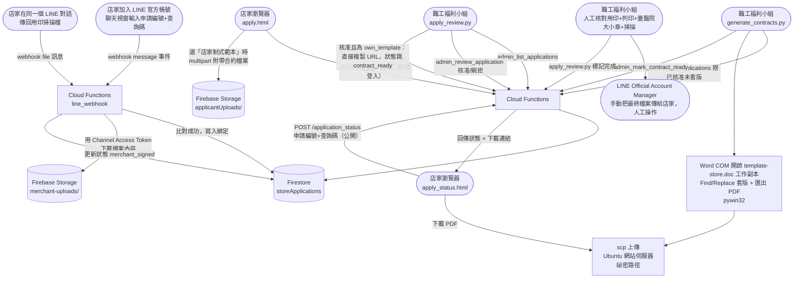

# SDD5 — 特約商店線上申請與合約套版流程

規格驅動開發文件。設計「店家線上申請加入特約 → 職工福利小組審核 → 系統自動套版產生合約 PDF → 雙方用印往返 → 結案」的完整流程，取代現行 `store/web/join.html` 純聯絡資訊頁的做法。

**實作現況（2026-09-11）**：

- **Phase 1、Phase 2 已完整實作並在正式環境驗收通過**——`store/web/apply.html`／`apply_status.html` 已部署上線，Cloud Functions（`apply`／`application_status`／`download_file`／`admin_list_applications`／`admin_review_application`／`admin_mark_contract_ready`）已部署到 `hlwelfare` 專案，`store/prepare_contract_template.py`／`generate_contracts.py` 已用真實申請資料跑過一次完整流程（送出申請 → 審核核准 → 套版產生 PDF → 上傳 → 查詢下載，兩種合約來源都測過），詳見 §7 驗收標準勾選狀態。純邏輯單元測試（`firebase/functions/tests/test_applications.py`）全數通過。
- **首次部署踩到的坑**（已修正，供之後參考）：`.env` 的環境變數名稱不能叫 `FIREBASE_STORAGE_BUCKET`——`firebase deploy` 會拒絕 `.env` 裡任何以 `FIREBASE_`／`X_GOOGLE_`／`EXT_`／`KIT_` 開頭的變數名稱（保留字首），已改名為 `STORAGE_BUCKET_NAME`。另外 `generate_contracts.py` 需要的 `STORE_PUBLIC_BASE_URL`（組合約 PDF 對外網址用）第一次忘了同步加進根目錄 `.env`，已補上。
- **Phase 3（LINE 官方帳號身分綁定與用印回傳）已部署並用真實 LINE 帳號驗收核心流程通過（2026-09-14）**——`firebase/functions/line_webhook_auth.py`（簽章驗證）、`line_messaging.py`（呼叫 LINE Messaging API 回覆訊息／下載檔案內容）、`merchant_binding.py`（身分綁定、節流、檔案接收）、`main.py` 新增的 `line_webhook`／`admin_update_status` 端點，`store/apply_review.py` 也擴充了 `--status merchant_signed`（人工核對用印後標記完成）跟 `--abandon` 兩個新流程。「花蓮職工福利行政小組」這個 LINE 官方帳號原本只有 LINE Login 頻道（LIFF 用），從來沒啟用過 Messaging API——實際是在 LINE Official Account Manager 的「設定→Messaging API」按下啟用後，才多出一個獨立的 Messaging API 頻道，`LINE_CHANNEL_SECRET`／`LINE_CHANNEL_ACCESS_TOKEN` 是從那個新頻道取得，跟既有的 `LINE_LOGIN_CHANNEL_ID` 是兩個完全不同的頻道。實測：加好友後輸入申請編號+查詢碼完成綁定、傳送檔案後狀態自動轉 `merchant_signed`、`download_file` 讀回內容正確；`apply_review.py --status merchant_signed`／`--abandon` 這兩個互動流程本身、節流機制、檔案類型/大小擋不合法這幾項還沒實測，詳見 §7。

---

## 1. 背景與問題

現行 `join.html` 只是一個靜態說明頁，店家想加入特約得自己打電話或寄 Email 給職工福利小組（曾先生），後續合約怎麼談、怎麼用印，全部是院外的人工流程，系統完全不參與。

現在想把「蒐集店家資訊」這一段數位化：店家在網頁上填表單，職工福利小組審核通過後，系統直接把店家填的資料套進合約書範本產生 PDF，店家自行下載、列印、用印後回傳，職工福利小組收到後也用印，再把雙方用印完成的合約回傳給店家。

## 2. 目標 / 非目標

**目標**
- 用網頁表單取代電話/Email 蒐集店家申請資訊（店名、負責人、統一編號、地址、電話、優惠內容等）。
- 申請時可選擇合約來源：**使用慈濟醫院合約範本**（系統套版產生 PDF）或**使用店家制式範本**（店家直接上傳自己的合約書檔案，交由職工福利小組審核內容），兩者核准後續流程共用。
- 職工福利小組審核通過後，系統自動把申請資料套進既有合約書範本，產生一份可下載的 PDF（僅限選擇「使用慈濟醫院合約範本」的申請）。
- 店家可自行下載合約 PDF，不需要職工福利小組每次手動寄檔案。
- 店家加入 LINE 官方帳號並完成身分核對後，可直接在聊天視窗把用印完成的掃描檔傳回來，取代 Email 附檔往返。
- 追蹤每筆申請目前進度（審核中／已核准／合約待下載／店家已回傳用印／雙方用印完成），職工福利小組看得到目前卡在哪一步。
- 延續本專案既有架構慣例：本機 Windows 腳本 + Cloud Functions + Firestore，本機不持有 Firebase 憑證，一律透過 `ADMIN_SHARED_SECRET` 打後端 admin 端點（見 `sdd3.md` §5、`sdd4.md` §4.3 已建立的慣例）。
- 審核時可查證統一編號是否真實存在、登記名稱是否與申請店名相符，作為職工福利小組審核的輔助資訊（見 §4.10）。

**非目標**
- **不做電子簽章／電子用印**：雙方用印維持實體大小章蓋印再掃描回傳的傳統做法，不整合 DocuSign 之類的第三方電子簽章服務——這類服務通常有月費，且醫院大小章的使用可能受既有內控規範限制，不是這次要解決的問題。
- **不自動寫回 Lotus Notes `ContributingStore.nsf`**：合約完成後，職工福利小組仍需比照現行方式手動把店家資料建進 Notes 特約商店資料庫，再跑既有的 `sync_stores_to_firestore.py` 讓查詢頁看得到。理由：這份表單蒐集的是「申請/合約」資訊，`ContributingStore.nsf` 的欄位（見 `sdd3.md` §4.1：`kind`/`tel`/`address`/`contents`/`expire`）不完全對應，且 Notes 那邊本來就是人工維護的權威資料來源，沒有必要為了省一次人工輸入去打通兩邊。
- **不做用印檔案的即時線上比對／驗證**（例如自動辨識掃描檔裡有沒有蓋到章）：收到店家回傳的用印檔案後，仍由職工福利小組人工檢查是否蓋章、簽名齊全。
- **統一編號查證只當輔助資訊，不當自動核准/拒絕的關卡**：政府登記資料庫本身就有查不到的例外（見 §4.10），查無資料不代表申請造假，最終還是職工福利小組人工判斷，不做成自動擋件的規則引擎。

## 3. 使用者情境

**店家申請（申請人視角）**
> 我在 `join.html` 看到「線上申請加入特約」的連結，點進去填店名、負責人、統一編號、地址、電話、Email、想提供的優惠內容，並選擇合約來源。如果我想直接用慈濟醫院的合約範本，這樣就填完了；如果我們公司有自己習慣用的制式合約，我可以選「使用店家制式範本」，表單會多一個上傳檔案的欄位，直接把我們的合約書檔案附上去一起送出。送出後畫面顯示我的申請編號跟一組查詢碼，提醒我要記下來，之後可以用這兩個資訊查詢審核進度。

**審核（職工福利小組視角）**
> 我執行 `apply_review.py`，看到目前待審核的申請清單，逐筆看內容，決定核准或婉拒（婉拒可以填理由）。如果這筆是「使用慈濟醫院合約範本」，核准時程式會問我這份合約的起訖日期（例如「自今天起一年」，或依實際跟店家談好的日期），由我自己輸入，不是系統自動算的；核准後執行 `generate_contracts.py`，程式會把核准但還沒產生合約的申請，套進合約書範本產生 PDF，上傳到網站伺服器，並把下載連結寫回申請紀錄。如果這筆是「使用店家制式範本」，我核准的當下系統就直接把店家上傳的檔案設成可下載的合約，不用等套版——但核准前我要多打開店家附上的合約書看一下條款內容合不合理，這部分沒辦法只看表單欄位判斷。

**下載與回傳（申請人視角）**
> 我審核通過後，用申請編號+查詢碼到查詢頁看到「合約已產生」，點連結下載 PDF。頁面同時邀請我加入「花蓮職工福利行政小組」LINE 官方帳號，加好友後在聊天視窗輸入我的申請編號+查詢碼完成身分核對。自己列印、蓋公司大小章跟負責人簽名後，直接在同一個 LINE 對話視窗把掃描檔案傳過去就好，不用再開 Email 附檔。

**用印與結案（職工福利小組視角）**
> 店家在 LINE 傳回用印掃描檔後，系統自動幫我存好檔案、標記這筆申請「店家已回傳」，我直接在 `apply_review.py` 看到有一筆等我核對。打開檔案人工檢查有沒有蓋好章——沒問題的話，把這份文件列印出來，蓋上醫院這邊的大小章，再掃描回電腦。最後我直接在 LINE Official Account Manager 那個店家的聊天視窗手動把雙方用印完成的最終檔案傳回去（這步是我在 LINE 後台手動上傳附件，不是系統程式發的），再執行 `apply_review.py` 把這筆申請標記「已完成」。

## 4. 設計

### 4.1 架構總覽

延續 `sdd3.md`/`sdd4.md` 建立的架構：靜態頁面部署在 Ubuntu 網站伺服器，後端邏輯在 Firebase Cloud Functions（Python）+ Firestore，本機 Windows 腳本透過 SSH/SCP 部署檔案、透過 HTTP + `ADMIN_SHARED_SECRET` 呼叫後端 admin 端點，**不持有任何 Firebase 憑證**（與 README「功能四」§ 說明的既有慣例一致）。

### 4.2 資料模型（Firestore）

**Collection：`storeApplications`**，Document ID：`{YYYYMMDD}-{序號}`（例如 `20260909-03`，方便電話溝通報號碼）

| 欄位 | 型別 | 說明 |
|---|---|---|
| `storeName` | string | 店名 |
| `ownerName` | string | 負責人姓名 |
| `taxId` | string | 統一編號（8 碼數字，前端+後端都要驗證格式） |
| `address` | string | 店址 |
| `phone` | string | 聯絡電話 |
| `email` | string | 聯絡 Email（合約產生後查詢/後續聯繫用） |
| `contactPerson` | string | 聯絡人（若非負責人本人，可留空） |
| `businessCategory` | string | 營業類別 |
| `discountContent` | string | 希望提供的優惠內容 |
| `note` | string | 其他備註（選填） |
| `contractSource` | string | `hospital_template`（使用慈濟醫院合約範本，走 §4.5.1 套版流程）\| `own_template`（使用店家制式範本，走 §4.5.2 直接上傳） |
| `ownTemplateStoragePath` | string \| null | 店家上傳的自有合約書在 Firebase Storage 裡的路徑（僅 `contractSource == "own_template"` 時，送出表單當下就有值）。**實作時改成存 Storage 路徑而不是外部網址**——bucket 規則整個鎖死，前端拿不到可以直接打開的網址，一律要透過 `download_file` 端點驗證身分後才能讀取（見 §4.4、§4.5.2） |
| `consentPersonalData` | boolean | 個資蒐集告知同意勾選，必須為 `true` 才能送出 |
| `queryCode` | string | 送出當下產生的隨機查詢碼（建議 8 碼英數），僅顯示給申請人一次，後續查詢進度用 |
| `status` | string | `pending` \| `approved` \| `rejected` \| `contract_ready` \| `merchant_signed` \| `completed` \| `abandoned` |
| `reviewNote` | string | 婉拒理由或審核備註 |
| `contractUrl` | string \| null | 合約下載資訊（`contract_ready` 之後才有值）。`hospital_template` 路徑是 Ubuntu 上的直接外部網址；`own_template` 路徑核准當下直接等於 `ownTemplateStoragePath`（Storage 路徑，不是外部網址，前端一樣要透過 `download_file` 端點才能下載，見 `application_status` 的回應設計） |
| `contractStartDate`／`contractEndDate` | date \| null | 合約起訖日（僅 `hospital_template` 路徑）。**由職工福利小組審核核准時人工指定**，透過 `admin_review_application` 寫入（見 §4.4），不是系統自動算的 |
| `finalDocUrl` | string \| null | 雙方用印完成的最終檔案網址（`completed` 之後才有值，選填，供申請人日後也能重新下載） |
| `submittedIp` | string | 送出時的來源 IP，僅供防濫用排查用 |
| `submittedAt`／`reviewedAt`／`contractGeneratedAt`／`merchantSignedAt`／`completedAt` | timestamp | 各狀態轉換時間戳 |

**Collection：`applyRateLimits`**（防濫用用），Document ID：`{IP}_{YYYYMMDD}`

| 欄位 | 型別 | 說明 |
|---|---|---|
| `count` | number | 當日送出次數，超過門檻（例如 5 次/天）直接拒絕新的 `/apply` 請求 |

**Collection：`applicationCounters`**（實作時新增，產生 `applicationId` 序號用），Document ID：`{YYYYMMDD}`

| 欄位 | 型別 | 說明 |
|---|---|---|
| `seq` | number | 當天已經產生過幾個申請編號，用 Firestore transaction 讀取後立刻遞增，避免同一秒兩筆申請拿到同個序號 |

### 4.3 公開申請表單（`store/web/apply.html`）

- 純靜態頁面，`fetch("POST", ".../apply")` 送出表單，比照 `store/web/liff/index.html` 的前後端分離風格，但**這裡完全不需要 LINE 登入**——申請人是院外店家，不是院內同仁，跟 `sdd3.md`/`sdd4.md` 的 LINE@ 驗證系統是兩條獨立路徑，不共用也不需要共用。
- 表單最上方是「合約來源」單選：**使用慈濟醫院合約範本** / **使用店家制式範本**。選後者時，動態顯示一個檔案上傳欄位（限 PDF/Word，見 §5 大小與類型限制），跟其他欄位一起用 `multipart/form-data` 送出，`apply` 端點在同一次請求裡處理文字欄位與檔案（見 §4.5.2）。
- 防濫用機制（先做最低成本的，避免一開始就過度設計）：
  1. **蜜罐欄位**：表單裡藏一個一般使用者看不到、只有機器人爬蟲填表機才會填的欄位，後端收到非空值直接靜默拒絕（回 200 但不寫入，避免讓攻擊者知道被擋）。
  2. **後端 IP 頻率限制**：`applyRateLimits` 每日每 IP 上限次數，超過回 429。
  3. 先不做 Google reCAPTCHA——待實際上線後觀察有沒有濫用問題再加，避免一開始就增加店家填表的摩擦（跟 `sdd3.md` §5.4 討論「不做過度前置的身分查證」精神一致）。
- 表單需附**個資蒐集告知同意**勾選框，文字內容需請福委會或院方法務確認標準用語後再定稿（見 §6 待確認）。
- 送出成功後，畫面明顯提示「請截圖或抄下申請編號與查詢碼，之後查詢進度需要用到」，因為**本設計不透過 Email 自動寄送查詢碼**（見下方 4.6 說明理由）。

### 4.4 後端：Cloud Functions 端點（`firebase/functions/main.py` 新增）

| 端點 | 存取層級 | 說明 |
|---|---|---|
| `apply` | 公開，無需登入 | 驗證必要欄位、統一編號格式、蜜罐欄位、IP 頻率限制通過後，建立 `storeApplications` 文件，回傳 `{applicationId, queryCode}`；`contractSource == "own_template"` 時另外接收 multipart 檔案，存進 Firebase Storage 並寫入 `ownTemplateFileUrl` |
| `application_status` | 公開，需帶 `applicationId` + `queryCode` | 比對 `queryCode` 正確才回傳該筆狀態，錯誤一律回「查無資料」（不透露是編號錯還是碼錯，避免被拿來枚舉） |
| `download_file` | 公開（帶 `applicationId`+`queryCode`）或 admin（帶 `X-Admin-Secret`），兩種擇一通過即可 | Firebase Storage 檔案唯一對外出口（見 §4.5.2、§4.7）。`kind=own_template` 下載店家自有合約書；`kind=merchant_signed` 下載店家透過 LINE 回傳的用印掃描檔。申請人查詢自己的申請時用查詢碼，`apply_review.py` 審核時看檔案內容用 admin 密鑰 |
| `admin_list_applications` | admin（`ADMIN_SHARED_SECRET`） | 依 `status` 篩選列出申請，供本機審核/套版腳本撈取 |
| `admin_review_application` | admin | 帶 `applicationId` + `decision`（approved/rejected）+ `reviewNote`，更新狀態；核准且 `contractSource == "hospital_template"` 時，**必須一併帶 `contractStartDate`／`contractEndDate`**（職工福利小組人工指定的合約起訖日，見 §4.5.1）；核准且 `contractSource == "own_template"` 時，額外把 `ownTemplateFileUrl` 複製成 `contractUrl` 並直接轉為 `contract_ready`（見 §4.5.2） |
| `admin_mark_contract_ready` | admin | 帶 `applicationId` + `contractUrl`，套版上傳完成後回寫，狀態轉為 `contract_ready` |
| `admin_update_status` | admin | 通用狀態轉換端點，供 `merchant_signed`／`completed`／`abandoned` 這幾個純人工判斷的狀態轉換使用（`line_webhook` 收到用印檔案時走 §4.7 自己的邏輯自動轉 `merchant_signed`，不呼叫這裡），`completed` 時可一併帶 `finalDocUrl` |
| `line_webhook` | 公開，但需驗證 LINE 簽章 | 店家 LINE 官方帳號的 webhook，處理身分綁定與用印檔案接收，見 §4.7 |

沿用 `sdd4.md` §4.3 的慣例：跟身分驗證無關的邏輯抽成共用函式，避免 `apply`／`application_status`（公開）跟 `admin_*`（需密鑰）两组端點的權限判斷各自寫一份、之後改壞其中一處没同步。

### 4.5 合約來源分流與 PDF 產生

申請表單的「合約來源」選項，決定核准後怎麼產生用來列印用印的檔案，兩條路徑只在「核准之前」不一樣，§4.6 起（下載、LINE 回傳、結案）完全共用。

#### 4.5.1 使用慈濟醫院合約範本（`contractSource == "hospital_template"`）

本機新腳本 `store/generate_contracts.py`：

1. 呼叫 `admin_list_applications?status=approved`，篩出還沒有 `contractUrl` 的申請。
2. 用 Word COM（`win32com.client.Dispatch("Word.Application")`，`pywin32` 已是既有相依套件，**不需要新增 `docxtpl` 這類新套件**）開啟範本的工作副本（`store/templates/contract_template.doc`，準備方式見下方「範本準備」），對範本裡已經手動插入的每個 `{{...}}` 佔位符呼叫 `Find.Execute(FindText=..., ReplaceWith=..., Replace=wdReplaceAll)` 逐一代入該筆申請資料。
3. 同一個 Word COM session 直接呼叫 `ExportAsFixedFormat`（或 `SaveAs2` 搭配 `wdFormatPDF`）把結果另存成 PDF，關閉文件時選擇不儲存變更，這台機器**已確認裝有 MS Word**（`C:\Program Files (x86)\Microsoft Office\root\Office16\WINWORD.EXE`），套版跟轉 PDF 是同一個 Word COM session 一次做完，中間不需要另存或轉換任何中繼檔案。

   **實際範本欄位對照**（已拿到範本檔案「特約廠商合約(含花慈資料).pdf」，內容比原先猜測的簡單很多——條款二、三、四、五、七整段都是固定文字，不含任何要套版的欄位；第 2 頁「附件1」識別證樣張是固定圖片頁，原封不動保留在範本裡即可，不需要程式處理）：

   | 範本上的空格 | 對應資料 | 說明 |
   |---|---|---|
   | 立契約書人「（以下簡稱乙方）」上方，以及文末簽名欄「乙方：」 | `{{store_name}}` | 乙方全銜，同一個佔位符在文件裡出現兩次，Word 的「全部取代」本來就會兩處都換掉 |
   | 條款一「乙方提供以下優惠：」後方空白 | `{{discount_content}}` | 表單填的優惠內容。**已實測支援條列式**：`apply.html` 的 `discountContent` 是多行文字框，店家按 Enter 換行，這個換行字元從表單、Firestore 到套版全程原樣保留，Word 置換時會照樣拆成多行——不是 Word 真正的自動編號清單，只是照文字原樣呈現，店家需要自己在每行開頭打符號（例如「．」），表單已加提示文字說明這點。範本裡「優惠：」跟 `{{discount_content}}` 之間額外插入一個段落內換行（`\x0b`），讓條列內容從下一行開始，不會跟「優惠：」擠在同一行（2026-09-11 依實際套版結果調整）。原本這樣做會有副作用：條列項目較多或店名較長時，整體內容變高會把文末「中華民國 年 月 日」簽約日期那行擠到自己獨占一頁——**已解決**：把段落 6 之後原本留給紙本手寫優惠內容的 4 行空白（現在已經自動套版、多餘了）一併刪除騰出空間，實測連同長店名+4 行條列一起測都能維持單頁，不會再多出空白頁 |
   | 條款六「自民國 年 月 日起至民國 年 月 日止」 | `{{start_y}}`／`{{start_m}}`／`{{start_d}}`／`{{end_y}}`／`{{end_m}}`／`{{end_d}}` | **由職工福利小組審核核准時人工指定**（不是系統自動算的），透過 `admin_review_application` 的 `contractStartDate`／`contractEndDate` 寫入 Firestore（見 §4.2、§4.4）；`generate_contracts.py` 套版時只需要把西元日期轉成民國年月日（減 1911）代入 |
   | 文末「中華民國 年 月 日」（簽約日期） | `{{sign_y}}`／`{{sign_m}}`／`{{sign_d}}` | 沿用 `contractStartDate` |
   | 乙方「地址」「負責人」「統一編號」「聯絡人」「聯絡電話」 | `{{address}}`／`{{owner_name}}`／`{{tax_id}}`／`{{contact_person}}`／`{{phone}}` | 直接對應表單欄位 |
   | 甲方「聯絡人」「聯絡電話」（範本上是空的） | 固定值，非表單欄位 | **已確認**：職工福利小組聯絡窗口為「曾建瑋／03-8561825 轉 15295」，寫死在 `generate_contracts.py` 裡當常數即可，不放進 `storeApplications` |
   | 甲方「地址」「負責人」「統一編號」（花蓮市中央路三段707號／林欣榮／94848325）、標題「特約廠商合約書」等 | 無 | 範本已印好的固定內容，原封不動 |

   **範本準備（一次性人工作業，不是 `generate_contracts.py` 執行時自動做的事）**：直接用你提供的 `store/template-store.doc` 當底稿，**不需要轉檔成 `.docx`**——這一步原本設計走 `docxtpl`（只吃 `.docx`）才需要多一道轉檔，但套版跟轉 PDF 既然都靠 Word COM（本來就得裝 MS Word 才能把 docx/doc 轉成 PDF），Word COM 本身可以直接開啟、直接存檔 `.doc`，不需要 `docxtpl` 這個套件，也就不需要轉檔：
   1. 複製一份 `store/template-store.doc` 到 `store/templates/contract_template.doc`（保留原始檔案不動，當作備份/對照用）。
   2. 用 Word 開啟 `contract_template.doc`，對照上表把每個空格直接打上對應的 `{{...}}` 文字（例如「（以下簡稱乙方）」上方那個空白處直接打上 `{{store_name}}`），存檔（還是存成 `.doc`，不用另存新檔）。
   3. 之後 `generate_contracts.py` 只需要讀這份已經包含佔位符的 `contract_template.doc`。

4. 用既有 SSH 金鑰 `scp` 把 PDF 上傳到 Ubuntu 網站伺服器一個隨機路徑（比照 `sdd4.md` §4.2 `BULLETIN_SECRET_SLUG` 的做法，這裡改成**每筆申請各自一個隨機 token**，例如 `{STORE_REMOTE_PATH}/contracts/{token}.pdf`，`token` 用 24 bytes 亂數產生），目錄列表沿用既有伺服器設定回 403。
5. 呼叫 `admin_mark_contract_ready`，把組出來的完整下載網址寫回 Firestore，狀態轉為 `contract_ready`。

**為什麼 PDF 產生放在本機腳本而不是 Cloud Functions？** 沿用本專案既有分工：Cloud Functions（Python，Linux 執行環境）沒有 MS Word/LibreOffice 這類重量級轉檔相依，硬要在雲端做需要另外接 Cloud Run + 自建容器，複雑度明顯提高；本機這台機器本來就已經在跑其他需要人工介入的排程（Notes 密碼互動限制），套版這步本來就是職工福利小組審核後手動觸發的動作，跟自動化程度沒有衝突，維持「本機做重活、Cloud Functions 只做狀態機與存取控制」的既有分工最省事。

#### 4.5.2 使用店家制式範本（`contractSource == "own_template"`）

店家在送出申請表單的當下，直接把自己公司的合約書檔案（PDF 或 Word）一起上傳，不等系統套版：

1. `apply.html` 選擇「使用店家制式範本」時，表單多顯示一個檔案上傳欄位，跟其他欄位一起用 `multipart/form-data` 送到 `apply`。
2. `apply` 端點把上傳的檔案存進 Firebase Storage（`applicantUploads/{applicationId}/draft_contract.{ext}`），寫入 `storeApplications.ownTemplateFileUrl`，此時狀態仍是 `pending`，等待審核。
3. 職工福利小組審核這類申請時（`apply_review.py`），要多做一件事：**打開店家上傳的合約書內容，確認條款可以接受**，不是只看表單填的基本資料——核准的判斷標準跟 4.5.1 的路徑不同，需要職工福利小組自己拿捏，系統不做內容審查（見 §6）。
4. 核准當下（`admin_review_application(decision="approved")`），後端偵測到該筆 `contractSource == "own_template"`，直接把 `ownTemplateFileUrl` 複製成 `contractUrl`、狀態直接跳到 `contract_ready`，**不需要跑 `generate_contracts.py`**——反正檔案內容就是店家自己上傳的那份，沒有套版這個動作。
5. 之後下載、用印、LINE 回傳、結案（§4.6 起）跟 4.5.1 路徑完全共用同一套流程。

**為什麼不要求店家先送出表單、審核通過後才回頭上傳合約檔案？** 這類申請店家本來就已經準備好自己的完整合約書了，讓他們在同一次表單提交時就附上，比起「先送出等審核、再回頭找連結上傳」少一次來回；審核者一次就能看到完整資訊（基本資料 + 合約內容）做判斷，不用等第二次互動。

### 4.6 商家下載與自助查詢（`store/web/apply_status.html`）

申請人輸入申請編號 + 查詢碼查詢目前進度；若狀態為 `contract_ready` 或之後，顯示下載連結。

**為什麼不用 Email 自動通知，而是「查詢碼由申請人自己保管，主動查詢」？**
- 本專案目前完全沒有寄發 Email 給外部收件人的基礎設施（既有的 LINE 推播只推給職工福利小組自己，`upload_joomla.py`/`query_news.py` 也不寄信），新增 SMTP 或第三方交易型郵件服務（SendGrid 等）是額外的相依與維運成本。
- 職工福利小組本來在核准/用印這幾個關卡就需要人工介入，**若申請人真的弄丟查詢碼，可以直接打電話/寄信給職工福利小組既有聯絡方式，由職工福利小組用統一編號或電話手動查詢**（`admin_list_applications` 加上關鍵字查詢即可支援，不需要額外設計「忘記查詢碼」的自助流程）。
- 這個折衷跟 `sdd3.md` §5.4 排除「個人化 Notes 信箱驗證連結」的精神一致：先選最低相依的做法，如果日後證實申請人真的常常弄丟查詢碼造成困擾，再考慮加 Email 通知。

### 4.7 身分綁定與用印檔案回傳（LINE 官方帳號）

店家加入「花蓮職工福利行政小組」LINE 官方帳號後，直接在聊天視窗傳回用印掃描檔，取代 Email 附檔往返。這是本專案第一次需要處理 LINE **webhook**（`follow`/`message` 事件），跟 `sdd3.md`/`sdd4.md` 既有的 LIFF + push 模式是不同的技術路徑，需要新增：

**新增 Cloud Functions 端點：`line_webhook`（公開，但需驗證 LINE 簽章）**

| 步驟 | 內容 |
|---|---|
| ① 驗證簽章 | 檢查 `X-Line-Signature` header（用 Channel Secret 做 HMAC-SHA256 比對），驗證失敗直接回 400，避免有人偽造 webhook payload |
| ② 身分綁定（`message` 事件，文字內容） | 若該 LINE userId 尚未綁定：解析文字內容比對「申請編號 + 查詢碼」（格式比照 `apply_status.html` 查詢頁，例如 `20260909-03 AB12CD34`），比對成功寫入 `merchantLineAuth/{lineUserId}` → `{applicationId}`，並回覆確認訊息（例如「已確認您是『○○店』，往後可以直接在這裡傳回用印檔案」）；比對失敗回覆提示重新輸入，並比照 §5.5 的節流設計限制連續失敗次數 |
| ③ 接收用印檔案（`message` 事件，`file`/`image` 類型） | 若該 LINE userId 已綁定：用 Messaging API 的內容下載端點（帶 Channel Access Token）取得檔案內容，存進 Firebase Storage（`merchant-uploads/{applicationId}/{timestamp}_{原檔名}`），把 `storeApplications` 該筆的 `merchantSignedFileUrl`／`merchantSignedAt` 寫回，狀態轉為 `merchant_signed`，並回覆已收到的確認訊息；若尚未綁定，回覆「請先輸入申請編號+查詢碼完成身分核對」 |
| ④ 其他事件 | 忽略或回覆制式說明文字（例如貼圖、非預期格式的訊息） |

**Collection：`merchantLineAuth`**，Document ID：LINE `userId`

| 欄位 | 型別 | 說明 |
|---|---|---|
| `applicationId` | string | 綁定的申請編號 |
| `boundAt` | timestamp | 綁定成功時間 |

**Collection：`merchantBindAttempts`**（實作時新增，防暴力猜測用，跟 §5.2 `codeAttempts` 同一套精神），Document ID：LINE `userId`

| 欄位 | 型別 | 說明 |
|---|---|---|
| `failCount` | number | 連續輸入錯誤次數 |
| `lockedUntil` | timestamp \| null | 鎖定解除時間，超過失敗次數上限（5 次）後鎖定 15 分鐘 |

**為什麼檔案存 Firebase Storage，不是既有的 SSH/SCP 到 Ubuntu？** 這是本專案目前唯一一個「檔案即時從外部（LINE 使用者）送進來、由 Cloud Functions 當下處理」的情境，跟其他既有流程（本機排程腳本批次匯出、SSH 上傳）性質不同——本機這台 Windows 機器不見得在 webhook 觸發當下是開著的，沒辦法排隊等它來拉檔案，Cloud Functions 收到當下就得直接找地方存住，而它本來就在同一個 Firebase 專案裡，用 Storage 是最直接的做法，不需要額外憑證。

**為什麼「回傳最終雙方用印檔案給店家」改成人工在 LINE Official Account Manager 後台手動傳送，而不是系統自動推送？** LINE Messaging API 沒有「file」這個可發送的訊息類型，程式沒辦法主動推送 PDF 給使用者；但 LINE Official Account Manager 本身的聊天介面支援客服人工上傳檔案給好友，這跟 Messaging API 的限制無關，是既有的基礎功能，職工福利小組直接在後台操作即可，不需要額外開發（見 §4.8）。

**標籤與圖文選單（暫緩，非本次範圍）**：綁定成功後，理論上可以進一步用「連結圖文選單給使用者」這支有公開 API 的端點，讓店家看到跟同仁不同的圖文選單（例如「合約問題」「下載合約」）；至於 LINE 聊天視窗的「標籤」功能沒有對外 API，只能人工在後台手動貼，維持既有基礎功能即可，不強求自動化。這兩點目前先不做，若店家申請量變大、人工操作變得繁瑣，再回來評估。

### 4.8 用印回傳與結案流程

延續 §4.7 的身分綁定，實際的用印往返步驟：

| 步驟 | 執行者 | 系統參與程度 |
|---|---|---|
| 店家列印、用印、掃描 | 店家 | 無（純店家自己的動作） |
| 店家把掃描檔在 LINE 對話視窗傳回 | 店家 → LINE 官方帳號 | 自動：`line_webhook` 收到檔案、存進 Firebase Storage、狀態自動轉 `merchant_signed`（見 §4.7） |
| 檢查用印是否齊全 | 職工福利小組 | 無，人工開啟 Firebase Storage 檔案肉眼檢查（`apply_review.py` 列出待檢查清單） |
| 列印、蓋院方大小章、掃描 | 職工福利小組 | 無 |
| 把最終合約傳回店家 | 職工福利小組 → 店家 | 無，直接在 LINE Official Account Manager 該店家的聊天視窗手動上傳附件傳送 |
| 標記「完成」，記錄最終檔案 | 職工福利小組 | 執行 `apply_review.py`，呼叫 `admin_update_status(status="completed", finalDocUrl=...)`（`finalDocUrl` 選填，若職工福利小組有把最終檔案也存回 Firebase Storage 留存的話） |

**為什麼不做「職工福利小組上傳最終檔案」的自動化端點？** 這一步只有職工福利小組自己會操作，且已經在使用 LINE Official Account Manager 處理這個店家的其他訊息，直接用後台內建的「傳送檔案」功能最順手，不需要再開一個上傳頁面。

**例外情況**：若店家不方便使用 LINE（例如年長負責人不用 LINE、或檔案格式 LINE 不支援），維持原本電話聯繫、Email 附檔到 `hl_welfare@tzuchi.com.tw` 作為備援管道，職工福利小組收到後手動呼叫 `admin_update_status(status="merchant_signed")` 補記錄即可，不是本設計要特別支援的正規路徑。

### 4.9 與 Notes 特約商店資料庫的關係

本設計完全不觸碰 `ContributingStore.nsf`。合約完成後，若要讓這家新店出現在 `sdd3.md` 的查詢頁上，職工福利小組仍需比照現行方式手動在 Notes 建一筆記錄，再執行既有的 `sync_stores_to_firestore.py`。這是刻意的邊界（見 §2 非目標），避免這次開發範圍無限擴大到「打通 Notes 寫入」這個明顯更複雜、且 Notes 那邊欄位語意跟合約申請表不完全對應的問題。

### 4.10 統一編號真實性查證

審核時查證申請表填的統一編號是否真的登記存在、登記名稱跟申請的店名是否相符，用政府本來就有開放、**不需要申請金鑰、即時查詢**的公開資料 API，不需要額外簽約或走審核流程：

| API | 用途 | 呼叫方式 | 實測結果 |
|---|---|---|---|
| 經濟部商工行政資料開放平臺「統編查公司名稱」 | 查「公司」登記（適用申請人是登記為公司的情況） | `GET http://data.gcis.nat.gov.tw/od/data/api/5F64D864-61CB-4D0D-8AD9-492047CC1EA6?$format=json&$filter=Business_Accounting_NO eq {統編}` | ✅ 已實測：完全公開，不需要 IP 白名單，帶真實統編可查到正確資料 |
| 經濟部商工行政資料開放平臺「商業統一編號查商號名稱」 | 查「商業／商號」登記（適用申請人是小吃店、商店這類獨資/合夥商業登記，特約商店裡更常見的情況） | `GET http://data.gcis.nat.gov.tw/od/data/api/855A3C87-003A-4930-AA4B-2F4130D713DC?$format=json&$filter=President_No eq {統編}`（`oid`／filter 欄位名稱都已用官方示範頁確認過） | ⚠️ **已實測會擋**：回應是「非授權介接之IP」，需要先向經濟部申請把本機固定對外 IP 加入白名單才能用——這點跟本節原本設計「兩個都免申請」不符，是實作時才發現的落差（見 §6） |

**查證邏輯（`store/apply_review.py` 呼叫 `store/tax_id_lookup.py`，審核時呼叫，不是自動關卡）**：

1. 先查「統編查公司名稱」，查到就把回傳的公司名稱跟申請表的 `storeName` 一起顯示給審核者看。
2. 查不到（或本身就查不到公司登記）再查「商業統一編號查商號名稱」——**目前這一步實測一定會被擋**（IP 未授權），審核者會看到明確的「查證功能未開通」提示，而不是被誤導成「查無登記資料」。等哪天真的申請到白名單，呼叫端邏輯不需要改，`lookup_business()` 會自然開始回真實資料。
3. 兩邊都查不到（或查證功能未開通），**不代表申請造假**——ECPay 文件也提到，公司福委會、部分政府機構及醫療機構等特殊單位本來就可能查不到（見來源），這種情況維持人工判斷，不擋件。
4. 名稱不完全相符也不擋件：很多小型店家的招牌名稱（申請表填的 `storeName`）跟商業登記的法定名稱本來就會不一樣（例如招牌是「阿美小吃」，商業登記名稱可能是負責人本名開頭的商號全稱），查證結果只是提供給職工福利小組參考，最終核准/婉拒還是人工判斷（見 §2 非目標）。

**為什麼不用 ECPay 那組包裝過的 API（`GetCompanyNameByTaxID`）？** 那組是 ECPay 特店專用的開發者 API，通常需要 ECPay 商店的 `MerchantID`／`HashKey`／`HashIV` 才能呼叫，本專案沒有 ECPay 商店帳號，沒必要為了這個小功能去申請一個電子支付服務商帳號；直接呼叫政府自己的開放資料平台，格式雖然陽春（OData 風格的 `$filter`），但完全不需要任何憑證，更適合這裡的用法。

**為什麼放在 `apply_review.py` 而不是 Cloud Functions？** 查證只在職工福利小組人工審核當下需要看一次，跟 §4.5 的套版一樣屬於本機互動操作的一部分，不需要另外幫 Cloud Functions 加一個對外查詢政府 API 的端點；沿用本機腳本直接 `requests.get()` 呼叫即可，維持「本機做重活、Cloud Functions 只做狀態機」的既有分工。

## 5. 安全性

- `apply`／`application_status` 是完全公開、無需登入的端點，**必須假設會被任何人呼叫**：欄位長度上限、統一編號格式（8 碼數字）務必在後端也驗證一次，不能只信任前端。
- `queryCode` 是查詢進度/下載合約的唯一憑證，需要有足夠亂數空間（建議至少 8 碼英數，即約 2×10^14 種組合）避免被暴力枚舉；`application_status` 端點應加失敗次數的簡易節流（比照 `sdd3.md` §5.2 `codeAttempts` 的精神），避免有人寫程式狂猜某個已知申請編號的查詢碼。
- 合約 PDF 內含統一編號、負責人姓名等店家業務資訊，敏感度介於「查詢頁店名地址」（低）跟「院內同仁身分驗證資料」（中）之間——沿用 `sdd4.md` §5 的「路徑亂碼即防護」模式，但 token 長度需比 bulletin 的更保守（bulletin 是全院共用一組 slug，這裡是每筆申請各自一組，泄漏範圍小很多，但仍建議 24 bytes 起跳）。
- `ADMIN_SHARED_SECRET` 沿用既有機制，本機腳本不得把它寫死在程式碼裡，一律讀 `.env`（比照 README 現有慣例）。
- 個資蒐集：統一編號、負責人姓名、店家聯絡資訊屬於「非本院同仁」的個資，蒐集目的（審核加入特約、產生合約）需要有清楚的告知同意文字，這點需要院方或福委會確認標準用語（見 §6），不是工程本身能決定的事。
- **`line_webhook` 必須驗證 LINE 簽章**（`X-Line-Signature`，HMAC-SHA256 用 Channel Secret 計算後比對），沒有驗證的話任何人都可以偽造 webhook payload，冒充店家傳假檔案或惡意內容進來。
- **身分綁定（申請編號+查詢碼）需要節流**：同一個 LINE userId 連續輸入錯誤達上限次數後應暫時鎖定，比照 §5.2 `codeAttempts` 的精神，避免有人用聊天視窗窮舉猜測其他店家的查詢碼。
- **接收店家上傳的檔案需要驗證類型與大小**：只接受 PDF/常見圖片格式（jpg/png），且需要合理大小上限（例如 20MB），避免有人傳來路不明的執行檔或超大檔案塞爆 Firebase Storage。
- **未完成綁定前不可接受任何檔案**：`line_webhook` 收到檔案訊息時務必先確認該 LINE userId 已綁定成功的 `applicationId`，否則檔案來源身分不明，無法歸檔也不該收下。
- **`apply` 端點的自有合約書上傳也是完全公開、無需登入**：跟 §4.7 LINE 檔案接收一樣，需要驗證檔案類型（僅接受 PDF/Word）與大小上限（例如 10MB），避免有人上傳來路不明的執行檔或超大檔案；這是本設計第二個會接受外部匿名檔案上傳的入口，兩處驗證邏輯應該共用同一份檢查函式，避免各自維護、之後改壞其中一處沒同步。

## 6. 已知限制 / 待確認事項

1. ~~需要拿到現行合約書範本的實際檔案~~ **已解決**：PDF 版「特約廠商合約(含花慈資料).pdf」與原始 Word 檔 `store/template-store.doc` 都已取得，兩者內容比對一致，實際欄位對照已整理進 §4.5.1。**範本準備也已經自動化並實測完成**（`store/prepare_contract_template.py`）：不需要人工用 Word 手動編輯插入佔位符，改成用 Word COM 對已核對過的段落位置做限定範圍的 Find/Replace，跑過一次、重開輸出檔案逐段核對，內容跟表格結構都正確——比原本設計「請職工福利小組手動在 Word 裡打字插入」更不容易出錯，也更容易在範本改版時重新產生。
2. ~~合約起訖日期怎麼決定~~ **已解決**：由職工福利小組審核核准時人工指定（`apply_review.py` 核准流程會詢問），不是系統自動算的，見 §4.2、§4.4、§4.5.1。
3. ~~甲方（本院）聯絡人/聯絡電話的固定值~~ **已解決**：曾建瑋／03-8561825 轉 15295，見 §4.5.1。
4. ~~這台機器是否已安裝 MS Word~~ **已解決**：已確認裝有 MS Word（`C:\Program Files (x86)\Microsoft Office\root\Office16\WINWORD.EXE`），§4.5.1 步驟 3 直接用 Word COM 轉 PDF，不需要 LibreOffice。
5. **個資告知同意的標準文字**：已先草擬一版放在附錄 A，**仍需送福委會或院方法務確認/修改後才能正式使用**，工程端只負責把同意勾選框做成必填。
6. ~~統一編號要不要做真實性查證~~ **已實作**（`store/tax_id_lookup.py`），`oid`／filter 欄位名稱都已用真實統編實測確認。**新發現待確認**：「商業統一編號查商號名稱」實測需要 IP 白名單才能用（見 §4.10 表格），需要職工福利小組決定要不要向經濟部商工行政資料開放平臺申請把這台機器（或未來固定執行 `apply_review.py` 的機器）的對外 IP 加入白名單——申請前這個資料集查證形同虛設（`lookup_business()` 一定回「查證功能未開通」），對最常見的「商業/商號」類型店家沒有實質查證效果，只有「公司登記」類型的申請人查得到。是否值得為此申請白名單，或維持現況純靠人工判斷，需要職工福利小組評估。
7. **蜜罐欄位 + IP 頻率限制是否足夠擋濫用**：先用最低成本方案上線觀察，若之後發現大量假申請灌進來，再加 Google reCAPTCHA v3。
8. **`queryCode` 遺失後的補救動線**：目前設計是打電話/寄信給職工福利小組，由職工福利小組用姓名/統編/電話手動查詢——需要確認 `admin_list_applications` 要不要加關鍵字搜尋參數方便這種情境（目前只設計了依 `status` 篩選）。
9. **是否要分階段實作**：建議第一階段先做「表單送出 + Firestore 儲存 + `apply_review.py` 審核」，讓蒐集資訊這件事先數位化（合約仍沿用現行人工填寫方式），等拿到範本檔案、確認轉檔可行後，第二階段再做 §4.5 的自動套版產生 PDF；§4.7/§4.8 的 LINE 綁定與檔案回傳可以再往後排第三階段。這樣可以先讓最有價值、風險最低的一半（取代電話聯繫）先上線，避免合約範本細節没確認清楚就卡住整個開發進度。
10. ~~部署 Phase 3 前，需要你親自到 LINE Developers Console 完成以下設定~~ **已解決（2026-09-14）**：「花蓮職工福利行政小組」這個 LINE 官方帳號原本**完全沒有啟用 Messaging API**（只有 LINE Login 頻道，`sdd3.md` 的 LIFF 就是掛在那個頻道底下），實際查證發現要到 **LINE Official Account Manager**（`manager.line.biz`，不是 LINE Developers Console）→ 設定 → Messaging API → 按「啟用 Messaging API」，才會在 LINE Developers Console 底下多出一個獨立的 Messaging API 頻道。取得該頻道的 **Channel Secret**（`LINE_CHANNEL_SECRET`）跟簽發的 **Channel Access Token**（`LINE_CHANNEL_ACCESS_TOKEN`）後，設定成 Cloud Functions 的 secret（`firebase functions:secrets:set`），部署後把 Webhook 網址（`https://us-central1-hlwelfare.cloudfunctions.net/line_webhook`）貼回 LINE Official Account Manager 的「回應設定」頁面並打開 Webhook 開關（這個開關在 OA Manager 本身就有，不需要另外跑一趟 LINE Developers Console）。「自動回應訊息」已確認關閉；「加入好友的歡迎訊息」目前還開著，不影響 `line_webhook`（只處理 message 事件，不處理 follow 事件），暫不處理。已用真實 LINE 帳號實測綁定+傳檔案流程成功，見 §7。
11. ~~Firebase 專案是否已啟用 Cloud Storage~~ **已解決**：已在 Firebase Console 開通，bucket 為 `gs://hlwelfare.firebasestorage.app`，安全性規則為正式版模式（`allow read, write: if false`，僅 Admin SDK 能讀寫，符合設計）。
12. **申請編號+查詢碼在聊天視窗打字核對的容錯**：使用者可能打錯格式（例如漏空格、全形/半形符號），`line_webhook` 解析時需要一定的容錯處理，細節留待實作時處理。
13. **「使用店家制式範本」的審核標準沒有明訂**：職工福利小組審核時要判斷店家自己上傳的合約條款能不能接受，這需要一份判斷基準（例如哪些條款一定要有、哪些不能出現），目前設計只寫「人工拿捏」，實際上線前建議先跟福委會/院方法務確認要不要訂一份簡單的審核checklist，避免每個人審核標準不一致。
14. **自有合約書上傳接受的檔案類型與大小上限**：暫定 PDF/Word、10MB，需要跟福委會確認實務上店家的合約書檔案是否常超過這個大小（例如含大量圖片或印章掃描檔）。
15. **乙方簽名區（表格欄位）遇到很長的店名仍會硬換行**：跟簽約日期擠成獨立一頁那個問題（已解決，見 §4.5.1）不同——那個是整體版面高度問題，這個是甲乙雙方並排資訊表格本身的欄寬限制，實測店名很長（例如登記為「○○股份/有限公司」的長全銜）時，「乙方：」那個欄位還是會卡在欄寬硬換行。優先度低（多數特約商店是小吃店/商店類，店名通常不會這麼長），先不處理，之後真的常遇到再考慮加寬該欄位。

## 7. 驗收標準

**表單與申請資料（第一階段）**
- [x] 店家可送出申請，必要欄位（含統一編號格式）在後端有驗證——**已對正式環境的 `apply` 端點實測**兩種合約來源（JSON／multipart）都能正確送出並擋掉不合法欄位；`apply.html` 網頁本身尚未有人實際用瀏覽器點過一輪（後端邏輯已確認正確）
- [x] 送出成功會產生唯一 `applicationId` + `queryCode`（實測：`20260911-01`／`02`／`03`）
- [ ] 蜜罐欄位非空時靜默拒絕（不寫入 Firestore，仍回應成功畫面避免透露防線）——尚未實測
- [ ] 單一 IP 超過每日上限次數會被拒絕（429）——尚未實測
- [ ] 職工福利小組可用 `apply_review.py` 列出待審核清單、核准或婉拒並填寫理由——**它呼叫的 `admin_list_applications`／`admin_review_application` 端點已直接實測正確**，但 `apply_review.py` 這支互動式 CLI 腳本本身還沒有人實際跑過一次
- [x] 選擇「使用店家制式範本」時，表單可正確上傳檔案並跟其他欄位一起送出，`ownTemplateStoragePath` 正確寫入（實測：`20260911-03`）
- [ ] 上傳的自有合約書檔案類型/大小超出限制時會被拒絕——尚未實測
- [x] 審核時可查到統一編號對應的政府登記名稱（公司或商業擇一查到即顯示），查無資料/查證功能未開通時清楚顯示對應訊息而不是誤判成錯誤或擋件——已用真實統編對 `store/tax_id_lookup.py` 實測過（見 §4.10）

**合約套版與下載（第二階段）**
- [x] `generate_contracts.py` 可正確把已核准申請（`contractSource == "hospital_template"`）的資料套進合約範本，產生格式正確的 PDF——**已對正式環境用真實送出並核准的申請（`20260911-02`）跑過一次完整流程**，下載下來核對過內容跟版面都正確
- [x] PDF 可透過 SSH/SCP 正確上傳到 Ubuntu 伺服器的隨機路徑，目錄列表回 403——已實測（PDF 本身回 200，`contracts/` 目錄列表回 403）
- [x] `contractSource == "own_template"` 的申請一經核准，`contractUrl` 立即等於 `ownTemplateStoragePath`、狀態直接變 `contract_ready`，不會誤跑套版流程——已實測
- [x] 申請人用 `applicationId` + `queryCode` 可在 `apply_status.html`（背後的 `application_status`／`download_file` 端點）查到「合約已產生」並下載（兩種合約來源皆可）——已實測，`apply_status.html` 網頁本身尚未有人實際點過
- [x] 查詢碼錯誤时一律回「查無資料」，不透露是編號錯還是碼錯——已實測（`application_status`、`download_file` 都測過）
- [ ] 職工福利小組可標記「店家已回傳用印」「雙方用印完成」，並記錄最終檔案下載網址（選填）——這幾個狀態轉換屬於 §4.7/§4.8（第三階段）範圍，`admin_update_status` 端點尚未實作

**LINE 身分綁定與用印檔案回傳（第三階段）**——已完成 LINE Developers Console 設定（取得 `LINE_CHANNEL_SECRET`／`LINE_CHANNEL_ACCESS_TOKEN`、Messaging API 頻道獨立於既有的 LINE Login 頻道之外另外啟用、設定 Webhook URL 並開啟）、部署上線，且**用真實 LINE 帳號跑過核心流程**：
- [x] 店家加入 LINE 官方帳號後，在聊天視窗輸入正確的申請編號+查詢碼可以完成綁定，並收到確認回覆——已用真實裝置實測（收到「已確認您是『測試商店-請忽略』」回覆）
- [ ] 輸入錯誤的申請編號/查詢碼組合會被拒絕且不會誤判綁定成功，連續錯誤達上限會被節流（`merchantBindAttempts`）——尚未實測
- [x] 已綁定的店家在聊天視窗傳送 PDF/圖片檔案，`line_webhook` 可正確下載並存進 Firebase Storage，`storeApplications` 狀態自動轉為 `merchant_signed`——已用真實裝置實測（傳送照片後狀態正確轉換，`download_file` 讀回內容正確）
- [ ] 未綁定的 LINE 使用者傳送檔案會被拒絕並提示先完成綁定——尚未實測
- [ ] 傳送的檔案類型/大小不符時會被拒絕並提示重傳（PDF/jpg/png、20MB 以內，見 §5）——尚未實測
- [x] `line_webhook` 沒有正確簽章的請求會被拒絕（400）——已實測（未帶簽章、假簽章皆正確拒絕；真實 LINE 簽章的請求正確通過）
- [ ] 職工福利小組用 `apply_review.py --status merchant_signed` 可以下載檢查店家回傳的用印檔案，確認後標記完成（`completed`）——底層的 `admin_update_status`／`download_file(kind=merchant_signed)` 端點已實測正確，但 `apply_review.py` 這個互動流程本身還沒有人實際跑過一次
- [ ] `apply_review.py --abandon <申請編號>` 可以正確把申請標記為 `abandoned`——尚未實測

## 附錄 A：個人資料蒐集、處理及利用告知事項（草稿，待法務確認）

> **這是工程端先草擬的版本，依「個人資料保護法」第八條應告知的五個項目寫的，正式上線前務必送福委會或院方法務確認用詞是否符合院內既有的個資告知慣例，必要時修改。** 放在 `apply.html` 表單的同意勾選框旁邊，勾選前應完整顯示。

---

### 個人資料蒐集、處理及利用告知事項

親愛的特約商店申請人您好：

為配合「特約商店加入申請暨合約簽訂」作業，佛教慈濟醫療財團法人花蓮慈濟醫院（以下簡稱本院）依「個人資料保護法」第八條規定，向您告知下列事項，請詳閱後勾選同意：

**一、蒐集之目的**
本院職工福利行政小組為審核貴店家／公司加入本院特約商店之資格、辦理特約合約之簽訂與履行、聯繫合約相關事宜（包含優惠內容確認、合約用印往返、合約續約或終止通知等），需蒐集下列個人資料。

**二、蒐集之個人資料類別**
負責人姓名、聯絡人姓名、聯絡電話、聯絡 Email，及與貴事業相關之統一編號、地址等資料。

**三、個人資料利用之期間、地區、對象及方式**
1. 期間：自蒐集之日起，至特約合約關係終止後，依本院文書保存年限規定之期間止。
2. 地區：中華民國境內。
3. 對象：本院職工福利行政小組及依合約履行需要之相關承辦人員；非依法令規定或經您同意，不會提供予其他第三人。
4. 方式：以電子化資料（含本申請系統資料庫、LINE 官方帳號通訊紀錄）及紙本合約文件方式儲存與利用。

**四、當事人權利**
依個人資料保護法第三條規定，您就本院所蒐集之個人資料，得行使下列權利：
1. 查詢或請求閱覽。
2. 請求製給複製本。
3. 請求補充或更正。
4. 請求停止蒐集、處理或利用。
5. 請求刪除。

如欲行使上述權利，請透過本頁面所留聯絡方式與本院職工福利行政小組聯繫。

**五、不提供個人資料之影響**
上述個人資料為審核加入特約商店及簽訂合約所必需，若您選擇不提供或提供不完整，本院將無法進行後續審核及合約簽訂作業。

☐ 我已詳閱並瞭解上述告知事項，同意本院依上述目的蒐集、處理及利用我所填寫之個人資料。

---
